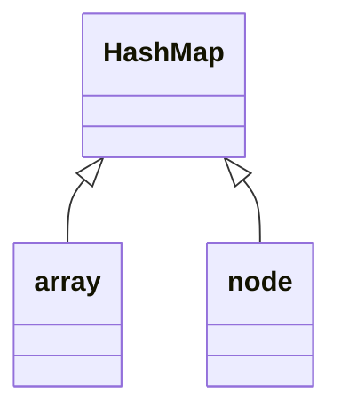
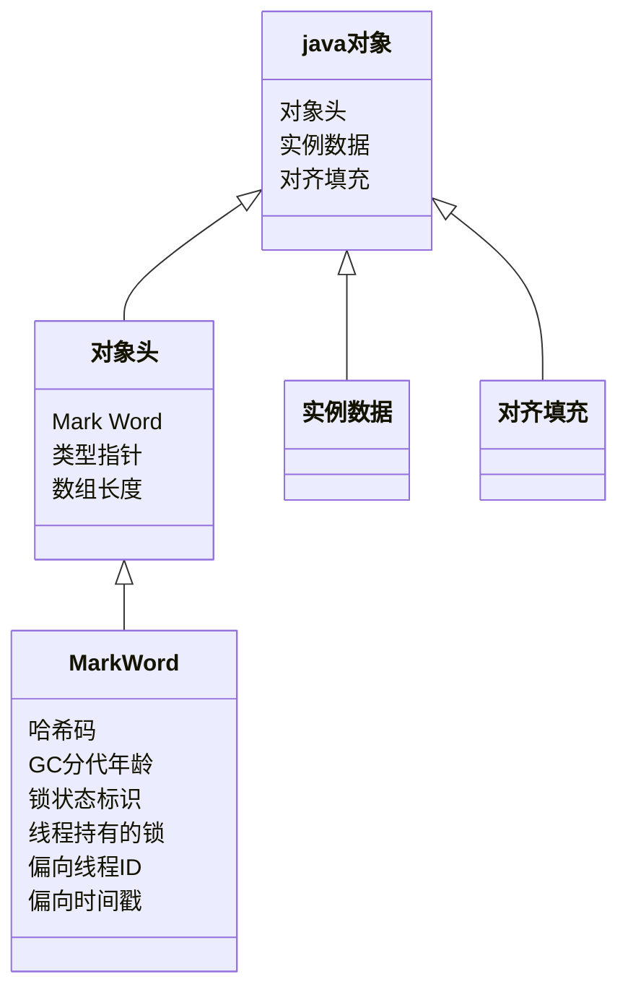
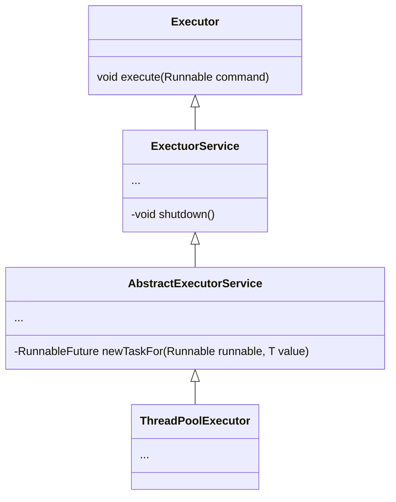
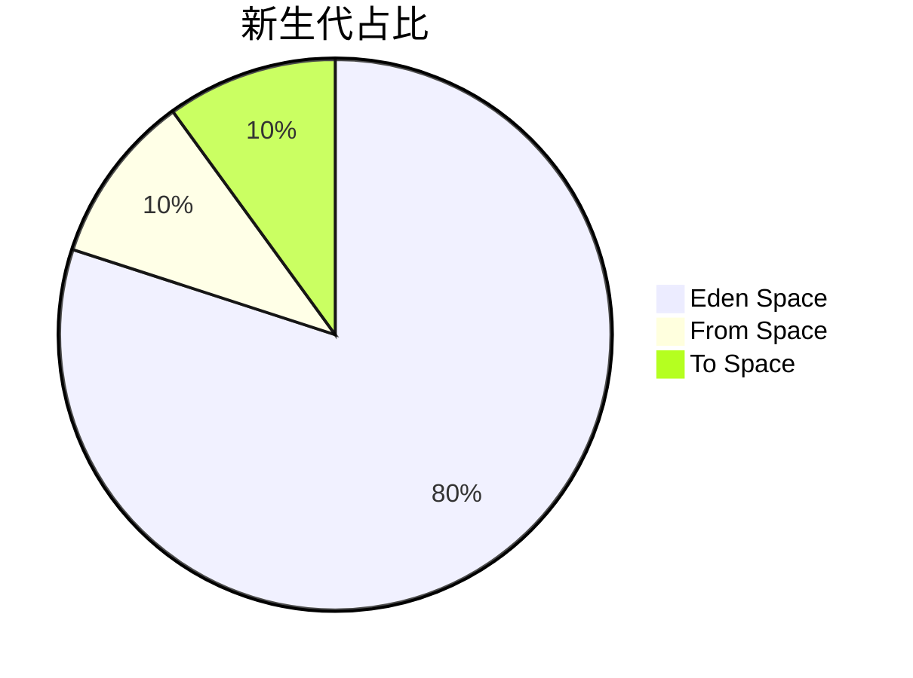

[TOC]

# 基础篇

### 1.HashMap

#### 1.1 数据结构 

> 数组加链表



```java
Node<K,V>[] tab
    static class Node<K,V> implements Map.Entry<K,V> {
    final int hash;
    final K key;
    V value;
    Node<K,V> next;
    ...
}
```

#### 1.2 hash算法优化（1.8以后）

```java
static final int hash(Object key) {
    int h;
    return (key == null) ? 0 : (h = key.hashCode()) ^ (h >>> 16);
}
```

**让高低16位进行异或，让他的低16同时保持了高低16位的特征，尽量避免hash值后续出现冲突**

#### 1.3 寻址算法的优化：用与运算代替取模，提升性能

`int bucket = (n - 1) & hash;`

 **n 代表hash数组容量，必须是2^n，不然会出现分布不均匀**

#### 1.4 hash碰撞
>默认采用链表，即当多个key寻址得到的bucket位置相同时，会在该数组index上产生链表【O(n)】,默认链表长度超过8时，转化为红黑树【O(logn)】	  

#### 1.5 resize

> 当数组长度< 数组长度 * 负载因子（默认0.75）的时候，进行扩容，假设需要容纳1000个元素，需要初始容量为 0.75 * size > 1000，2048（2^n）

* **jdk1.7之前采用头插法，先准备一个 2*oldSize长度的数组，再进行rehash，重新定位每个元素的新位置**

```java
void resize(int newCapacity) {   //传入新的容量  
    Entry[] oldTable = table;    //引用扩容前的Entry数组  
    int oldCapacity = oldTable.length;  
    if (oldCapacity == MAXIMUM_CAPACITY) {  //扩容前的数组大小如果已经达到最大(2^30)了  
        threshold = Integer.MAX_VALUE; //修改阈值为int的最大值(2^31-1)，这样以后就不会扩容了  
        return;  
    }  

    Entry[] newTable = new Entry[newCapacity];  //初始化一个新的Entry数组  
    transfer(newTable);                         //！！将数据转移到新的Entry数组里  
    table = newTable;                           //HashMap的table属性引用新的Entry数组  
    threshold = (int) (newCapacity * loadFactor);//修改阈值  
}  
```

```java
void transfer(Entry[] newTable) {
      Entry[] src = table;                   //src引用了旧的Entry数组  
      int newCapacity = newTable.length;
      for (int j = 0; j < src.length; j++) { //遍历旧的Entry数组  
          Entry<K, V> e = src[j];             //取得旧Entry数组的每个元素  
          if (e != null) {
              src[j] = null;//释放旧Entry数组的对象引用（for循环后，旧的Entry数组不再引用任何对象）                do {
                    Entry<K, V> next = e.next;
                    int i = indexFor(e.hash, newCapacity); //！！重新计算每个元素在数组中的位置 
                    e.next = newTable[i]; //标记[1]  
                    newTable[i] = e;      //将元素放在数组上  
                    e = next;             //访问下一个Entry链上的元素  
                } while (e != null);
            }
      }
}
```

**线程并发的时候，会导致死循环（a-b-a循环链表）和数据丢失，原因分别为 头插法导致链表逆反 和 src[j] = null;**

* **jdk1.8 进行了优化，首先rehash算法，不再采用 h & (length - 1)，而是通过以下算法去判断key的新位置**

  **扩容前：**

  ```
  0000 1111   数组大小
  0000 0101   具体参数 a
  0001 0101   具体参数 b
  ```
  
  **这时由于数组大小占4位，故只能取和数组大小相同位置位数，a、b所在数组位置相同**

  **扩容后: **
  
  ```
  0001 1111 原数组大小*2
  0000 0101 新增位为0，a 位置不变
  0001 0101 新增位为1，b 位置 = i(原数组位置)+oldCap
  ```
  

**由于新增的1bit是0还是1可以认为是随机的，因此resize的过程，均匀的把之前的冲突的节点分散到新的bucket了，解决了循环链表问题，但仍会出线数据丢失**


### 2.ConcurrentHashMap

#### 2.1  JDK1.7实现
> ConcurrentHashMap的数据结构是由一个Segment数组和多个HashEntry组成，Segment数组的意义就是将一个大的table分割成多个小的table来进行加锁，也就是上面的提到的锁分离技术，而每一个Segment元素存储的是HashEntry数组+链表，这个和HashMap的数据存储结构一样

`ReentrantLock+Segment+HashEntry`

##### 2.2.1 初始化

> ConcurrentHashMap的初始化是会通过位与运算来初始化Segment的大小，用size来表示，如下所示

```java
int size =1;
    while(size < concurrencyLevel) {
      ++a;
      size <<=1;
}      
```

> 如上所示，因为ssize用位与运算来计算（ size <<=1 ），所以Segment的大小取值都是以2的N次方，无关concurrencyLevel的取值，当然concurrencyLevel最大只能用16位的二进制来表示，即65536，换句话说，Segment的大小最多65536个，没有指定concurrencyLevel元素初始化，Segment的大小size默认为16

>  每一个Segment元素下的HashEntry的初始化也是按照位与运算来计算，用cap来表示，如下所示

```java
int cap =1;
while(cap < c)
  cap <<=1;
```

> 如上所示，HashEntry大小的计算也是2的N次方（cap <<=1）， cap的初始值为1，所以HashEntry最小的容量为2	 

##### 2.1.2 put操作

> 对于ConcurrentHashMap的数据插入，这里要进行两次Hash去定位数据的存储位置

`static class Segment<K,V> extends ReentrantLock implements Serializable {}`

> 从上Segment的继承体系可以看出，Segment实现了ReentrantLock,也就带有锁的功能，当执行put操作时，会进行第一次 key的hash来定位Segment的位置，如果该Segment还没有初始化，即通过CAS操作进行赋值，然后进行第二次hash操作，找到相应的HashEntry的位置，这里会利用继承过来的锁的特性，在将数据插入指定的HashEntry位置时（链表的尾端），会通过继承ReentrantLock的tryLock（）方法尝试去获取锁，如果获取成功就直接插入相应的位置，如果已经有线程获取该Segment的锁，那当前线程会以自旋的方式去继续的调用tryLock（）方法去获取锁，超过指定次数就挂起，等待唤醒

#####  2.2.3 get操作

> ConcurrentHashMap的get操作跟HashMap类似，只是ConcurrentHashMap第一次需要经过一次hash定位到Segment的位置，然后再hash定位到指定的HashEntry，遍历该HashEntry下的链表进行对比，成功就返回，不成功就返回null

##### 2.2.4 size操作

> 计算ConcurrentHashMap的元素大小是一个有趣的问题，因为他是并发操作的，就是在你计算size的时候，他还在并发的插入数据，可能会导致你计算出来的size和你实际的size有相差（在你return size的时候，插入了多个数据），要解决这个问题，JDK1.7版本用两种方案

```java
final Segment<k,v>[] segments = this.segments;
int size;
boolean overflow;   //true if size overflows 32 bit
long sum;           //sum of modCount
long last = 0L;     //previous sum
int retries = -1;   //first iteration is't retry   
try{	   
	for(;;) {
	    if(retries++ == RETRIES_BEFORE_LOCK) {
			for(int j = 0; j < segments.length; ++j) 
			   ensureSegment(j).lock();  // force creation  
		}  

		sum = 0L;  
        size = 0;  
        overflow = false;  
        for(int j = 0;j < segments.length; ++j) {  
           Segment<K,V> seg = segmentAt(segments, j);  
           if  (seg !=  null) { 
                sum += seg.modCount; 
                int c = seg.count;  
                if  (c < 0 || (size += c) < 0)  
                     overflow = true;
           } 			   
        }  

        if(sum == last)
           break;  

        last = sum; 
     } 
}finally { 
    if (retries > RETRIES_BEFORE_LOCK) {  
       for (int j = 0; j < segments.length; ++j)  
         segmentAt(segments, j).unlock();  
    }  
} 
```

**第一种方案他会使用不加锁的模式去尝试多次计算ConcurrentHashMap的size，最多2次，比较前后两次计算的结果，结果一致就认为当前没有元素加入，计算的结果是准确的**
**第二种方案是如果第一种方案不符合，他就会给每个Segment加上锁，然后计算ConcurrentHashMap的size返回**

#### 2.2  JDK1.8实现：

> JDK1.8的实现已经摒弃了Segment的概念，而是直接用Node数组+链表+红黑树的数据结构来实现，并发控制使用Synchronized和CAS来操作， 整个看起来就像是优化过且线程安全的HashMap，虽然在JDK1.8中还能看到Segment的数据结构，但是已经简化了属性，只是为了兼容旧版本

**说明：ConcurrentHashMap的数据结构（数组+链表+红黑树），桶中的结构可能是链表，也可能是红黑树，红黑树是为了提高查找效率。**

**初始值：**

```java
private static final int MAXIMUM_CAPACITY = 1 << 30 ;  // node数组最大容量：2^30=1073741824  
private static final int DEFAULT_CAPACITY = 16 ;       // 默认初始值，必须是2的幕数
	   
private static final float LOAD_FACTOR = 0.75f;        // 负载因子  
	   	   
static final int TREEIFY_THRESHOLD = 8;                // 链表转红黑树阀值,> 8 链表转换为红黑树  
transient volatile Node<K,V>[] table;  	               //存放node的数组  
```

> 和HashMap相似，ConcurrentHashMap的初始化其实是一个空实现，并没有做任何事，这里后面会讲到，这也是和其他的集合类有区别的地方，初始化操作并不是在构造函数实现的，而是在put操作中实现，当然ConcurrentHashMap还提供了其他的构造函数

##### 2.2.1 put操作

> 1.如果没有初始化就先调用initTable（）方法来进行初始化过程
> 2.如果没有hash冲突就直接CAS插入
> 3.如果还在进行扩容操作就先进行扩容
> 4.如果存在hash冲突，就加锁来保证线程安全，这里有两种情况，一种是链表形式就直接遍历到尾端插入，一种是红黑树就按照红黑树结构插入
> 5.最后一个如果该链表的数量大于阈值8，就要先转换成黑红树的结构，break再一次进入循环
> 6.如果添加成功就调用addCount（）方法统计size，并且检查是否需要扩容

#####  2.2.2 get操作

> 1.计算hash值，定位到该table索引位置，如果是首节点符合就返回
> 2.如果遇到扩容的时候，会调用标志正在扩容节点ForwardingNode的find方法，查找该节点，匹配就返回 
> 3.以上都不符合的话，就往下遍历节点，匹配就返回，否则最后就返回null

#####  2.2.3 size操作

> 在JDK1.8版本中，对于size的计算，在扩容和addCount()方法就已经有处理了，JDK1.7是在调用size()方法才去计算，其实在并发集合中去计算size是没有多大的意义的，因为size是实时在变的，只能计算某一刻的大小，但是某一刻太快了，人的感知是一个时间段，所以并不是很精确

#### 2.3 总结

> **1.** JDK1.8的实现降低锁的粒度，JDK1.7版本锁的粒度是基于Segment的，包含多个HashEntry，而JDK1.8锁的粒度就是HashEntry（首节点）
> **2.** JDK1.8版本的数据结构变得更加简单，使得操作也更加清晰流畅，因为已经使用synchronized来进行同步，所以不需要分段锁的概念，也就不需要Segment这种数据结构了，由于粒度的降低，实现的复杂度也增加了
> **3.** JDK1.8使用红黑树来优化链表，基于长度很长的链表的遍历是一个很漫长的过程，而红黑树的遍历效率是很快的，代替一定阈值的链表，这样形成一个最佳拍档
> **4.** JDK1.8为什么使用内置锁synchronized来代替重入锁ReentrantLock，我觉得有以下几点
>
>       a.因为粒度降低了，在相对而言的低粒度加锁方式，synchronized并不比ReentrantLock差，在粗粒度加锁中ReentrantLock可能通过Condition来各个低粒度的边界，更加的灵活，而在低粒度中，Condition的优势就没有了控制
>       b.JVM的开发团队从来都没有放弃synchronized，而且基于JVM的synchronized优化空间更大，使用内嵌的关键字比使用API更加自然
>       c.在大量的数据操作下，对于JVM的内存压力，基于API的ReentrantLock会开销更多的内存，虽然不是瓶颈，但是也是一个选择依据

**参考文档：https://www.jianshu.com/p/865c813f2726**


### 3.Synchronized

#### 3.1 作用域

>  a.普通同步方法：锁是当前实例对象；
>  b.静态同步方法：锁是当前类的Class对象，因为Class数据存在于永久代，因此静态方法锁相当于该类的一个全局锁；
> c.同步方法块：锁是Synchronized括号里配置的对象;

#### 3.2 同步原理

> 概述：synchronized关键字，在底层编译后的jvm指令中，会有monitorenter和monitorexit两个指令

```java
monitorenter
// 代码对应的指令
monitorexit
```

**monitorenter:**

>  1) 如果monitor的进入数为0，则该线程进入monitor，然后将进入数设置为1，该线程即为monitor的所有者；

>  2) 如果线程已经占有该monitor，只是重新进入，则进入monitor的进入数加1；

>  3) 如果其他线程已经占用了monitor，则该线程进入阻塞状态，直到monitor的进入数为0，再重新尝试获取monitor的所有权； 

**monitorexit:** 

> 执行monitorexit的线程必须是objectref所对应的monitor的所有者。指令执行时，monitor的进入数减1，如果减1后进入数为0，那线程退出monitor，不再是这个monitor的所有者。 其他被这个monitor阻塞的线程可以尝试去获取这个 monitor 的所有权

**特例：**

>同步方法： `public synchronized void method()` ，反编译后发现其通过ACC_SYNCHRONIZED来实现同步

**ACC_SYNCHRONIZED: **

> 当方法调用时，调用指令将会检查方法的 ACC_SYNCHRONIZED 访问标志是否被设置，如果设置了，执行线程将先获取monitor，获取成功之后才能执行方法体，方法执行完后再释放monitor。在方法执行期间，其他任何线程都无法再获得同一个monitor对象。

#### 3.3 同步概念

##### 3.3.1 对象头

* java对象：在JVM中，对象在内存中的布局分为三块区域：对象头、实例数据和对齐填充。

  * 对象头：存储对象自身的运行时数据（Mark Word）; 类型指针; 若为对象数组，还应有记录数组长度的数据（对象头一般占用2个机器码，在32位虚拟机中是32bit，在64位虚拟机中是64bit）

    * Mark Word: 哈希码；GC分代年龄； 锁状态标识； 线程持有的锁； 偏向线程ID； 偏向时间戳（实现轻量级锁和偏向锁的关键）
    


`Java对象头结构组成`

| 长度     | 内容                   |
| -------- | ---------------------- |
| 32/64bit | Mark Word              |
| 32/64bit | Class Metadata Address |
| 32/64bit | Array lenth            |

`Mark Word存储结构(无锁，32位)`

| 25bit          | 4bit         | 1bit是否是偏向锁 | 2bit锁标志位 |
| -------------- | ------------ | ---------------- | ------------ |
| 对象的HashCode | 对象分代年龄 | 0                | 01           |

`Mark Word可能存储4种数据(有锁，32位)`

| 锁状态 | 25bit |  4bit | 1bit(是否是否偏向锁) | 2bit(锁标志位) |
| ------ | ----- |  ---- | ---- | ---- |
| 轻量级锁 | 指向栈中锁记录的指针 |       |                      | 00 |
| 重量级锁 | 指向互斥量（重量级锁）的指针 |           |      | 10 |
| GC标记 | 空 |            |      | 11 |
| 偏向锁 | 线程ID (23bit)     Epoch（2bit） | 对象分代年龄 | 1 | 01 |

**64位机略**

> 对象头的最后两位存储了锁的标志位，01是初始状态，未加锁，其对象头里存储的是对象本身的哈希码，随着锁级别的不同，对象头里会存储不同的内容。

> 偏向锁存储的是当前占用此对象的线程ID；而轻量级则存储指向线程栈中锁记录的指针。

> 从这里我们可以看到，“锁”这个东西，可能是个锁记录+对象头里的引用指针（判断线程是否拥有锁时将线程的锁记录地址和对象头里的指针地址比较)，也可能是对象头里的线程ID（判断线程是否拥有锁时将线程的ID和对象头里存储的线程ID比较）。

` HotSpot 虚拟机对象头Mark Word`

| 存储内容                            | 标志位 | 状态     |
| ----------------------------------- | ------ | -------- |
| 对象哈希码、对象分代年龄            | 01     | 未锁定   |
| 指向锁记录的指针                    | 00     | 轻量级锁 |
| 指向重量级锁的指针                  | 10     | 膨胀     |
| 空，不需要记录信息                  | 11     | GC标记   |
| 偏向线程ID,偏向时间戳，对象分代年龄 | 01     | 可偏向   |

##### 3.3.2 对象头中Mark Word与线程中Lock Record

> 在线程进入同步代码块的时候，如果此同步对象没有被锁定，即它的锁标志位是01，则虚拟机首先在当前线程的栈中创建我们称之为“锁记录（Lock Record）”的空间，用于存储锁对象的Mark Word的拷贝，官方把这个拷贝称为Displaced Mark Word。整个Mark Word及其拷贝至关重要。

>  Lock Record是线程私有的数据结构，每一个线程都有一个可用Lock Record列表，同时还有一个全局的可用列表。每一个被锁住的对象Mark Word都会和一个Lock Record关联（对象头的MarkWord中的Lock Word指向Lock Record的起始地址），同时Lock Record中有一个Owner字段存放拥有该锁的线程的唯一标识（或者object mark word），表示该锁被这个线程占用。

`Lock Record的内部结构`

| Lock Record | 描述                                                         |
| ----------- | ------------------------------------------------------------ |
| Owner       | 初始时为NULL表示当前没有任何线程拥有该monitor record，当线程成功拥有该锁后保存线程唯一标识，当锁被释放时又设置为NULL； |
| EntryQ      | 关联一个系统互斥锁（semaphore），阻塞所有试图锁住monitor record失败的线程； |
| RcThis      | 表示blocked或waiting在该monitor record上的所有线程的个数；   |
| Nest        | 用来实现重入锁的计数；                                       |
| HashCode    | 保存从对象头拷贝过来的HashCode值（可能还包含GC age）;        |
| Candidate   | 用来避免不必要的阻塞或等待线程唤醒，因为每一次只有一个线程能够成功拥有锁，如果每次前一个释放锁的线程唤醒所有正在阻塞或等待的线程，会引起不必要的上下文切换（从阻塞到就绪然后因为竞争锁失败又被阻塞）从而导致性能严重下降。Candidate只有两种可能的值0表示没有需要唤醒的线程，1表示要唤醒一个继任线程来竞争锁。 |

##### 3.3.3 监视器（Monitor）

> 任何一个对象都有一个Monitor与之关联，当且一个Monitor被持有后，它将处于锁定状态。Synchronized在JVM里的实现都是基于进入和退出Monitor对象来实现方法同步和代码块同步，虽然具体实现细节不一样，但是都可以通过成对的MonitorEnter和MonitorExit指令来实现。

> 与一切皆对象一样，所有的Java对象是天生的Monitor，每一个Java对象都有成为Monitor的潜质，因为在Java的设计中 ，每一个Java对象自打娘胎里出来就带了一把看不见的锁，它叫做内部锁或者Monitor锁。

> 也就是通常说Synchronized的对象锁，MarkWord锁标识位为10，其中指针指向的是Monitor对象的起始地址。在Java虚拟机（HotSpot）中，Monitor是由ObjectMonitor实现的，其主要数据结构如下（位于HotSpot虚拟机源码ObjectMonitor.hpp文件，C++实现的）：

```C++
ObjectMonitor() {
        _header       = NULL;
        _count        = 0; // 记录个数
        _waiters      = 0,
        _recursions   = 0;
        _object       = NULL;
        _owner        = NULL;
        _WaitSet      = NULL; // 处于wait状态的线程，会被加入到_WaitSet
        _WaitSetLock  = 0 ;
        _Responsible  = NULL ;
        _succ         = NULL ;
        _cxq          = NULL ;
        FreeNext      = NULL ;
        _EntryList    = NULL ; // 处于等待锁block状态的线程，会被加入到该列表
        _SpinFreq     = 0 ;
        _SpinClock    = 0 ;
        OwnerIsThread = 0 ;
}
```

> ObjectMonitor中有两个队列，`_WaitSet `和 `_EntryList`，用来保存ObjectWaiter对象列表（ 每个等待锁的线程都会被封装成ObjectWaiter对象 ），`_owner`指向持有ObjectMonitor对象的线程，当多个线程同时访问一段同步代码时：
>
> ```
> 1.首先会进入 _EntryList 集合，当线程获取到对象的monitor后，进入 _Owner区域并把monitor中的owner变量设置为当前线程，同时monitor中的计数器count加1；
> 2.若线程调用 wait() 方法，将释放当前持有的monitor，owner变量恢复为null，count自减1，同时该线程进入 WaitSet集合中等待被唤醒；
> 3.若当前线程执行完毕，也将释放monitor（锁）并复位count的值，以便其他线程进入获取monitor(锁)；
> ```

> 同时，Monitor对象存在于每个Java对象的对象头Mark Word中（存储的指针的指向），Synchronized锁便是通过这种方式获取锁的，也是为什么Java中任意对象可以作为锁的原因，同时notify/notifyAll/wait等方法会使用到Monitor锁对象，所以必须在同步代码块中使用。

#### 3.4 锁的优化

> 从JDK6开始，就对synchronized的实现机制进行了较大调整，包括使用JDK5引进的CAS自旋之外，还增加了自适应的CAS自旋、锁消除、锁粗化、偏向锁、轻量级锁这些优化策略。

> 锁主要存在四种状态，依次是：无锁状态、偏向锁状态、轻量级锁状态、重量级锁状态，锁可以从偏向锁升级到轻量级锁，再升级的重量级锁。但是锁的升级是单向的，也就是说只能从低到高升级，不会出现锁的降级。（在 JDK 1.6 中默认是开启偏向锁和轻量级锁的，可以通过-XX:-UseBiasedLocking来禁用偏向锁。）

#####  3.4.1 自旋锁

> 线程的阻塞和唤醒需要CPU从用户态转为核心态，频繁的阻塞和唤醒对CPU来说是一件负担很重的工作，势必会给系统的并发性能带来很大的压力。同时我们发现在许多应用上面，对象锁的锁状态只会持续很短一段时间，为了这一段很短的时间频繁地阻塞和唤醒线程是非常不值得的。

> 所谓自旋锁，就是指当一个线程尝试获取某个锁时，如果该锁已被其他线程占用，就一直循环检测锁是否被释放，而不是进入线程挂起或睡眠状态。

> 自旋锁适用于锁保护的临界区很小的情况，临界区很小的话，锁占用的时间就很短。自旋等待不能替代阻塞，虽然它可以避免线程切换带来的开销，但是它占用了CPU处理器的时间。如果持有锁的线程很快就释放了锁，那么自旋的效率就非常好，反之，自旋的线程就会白白消耗掉处理的资源，它不会做任何有意义的工作，典型的占着茅坑不拉屎，这样反而会带来性能上的浪费。所以说，自旋等待的时间（自旋的次数）必须要有一个限度，如果自旋超过了定义的时间仍然没有获取到锁，则应该被挂起。（在JDK1.6中默认开启。同时自旋的默认次数为10次，可以通过参数-XX:PreBlockSpin来调整。）

##### 3.4.2 适应性自旋锁

> 如果通过参数-XX:PreBlockSpin来调整自旋锁的自旋次数，会带来诸多不便。假如将参数调整为10，但是系统很多线程都是等你刚刚退出的时候就释放了锁（假如多自旋一两次就可以获取锁），是不是很尴尬。于是JDK1.6引入自适应的自旋锁，让虚拟机会变得越来越聪明。

> 所谓自适应就意味着自旋的次数不再是固定的，它是由前一次在同一个锁上的自旋时间及锁的拥有者的状态来决定。

**策略：**

> a.线程如果自旋成功了，那么下次自旋的次数会更加多，因为虚拟机认为既然上次成功了，那么此次自旋也很有可能会再次成功，那么它就会允许自旋等待持续的次数更多。
> b.如果对于某个锁，很少有自旋能够成功，那么在以后要或者这个锁的时候自旋的次数会减少甚至省略掉自旋过程，以免浪费处理器资源。

##### 3.4.3 锁消除

> 为了保证数据的完整性，在进行操作时需要对这部分操作进行同步控制，但是在有些情况下，JVM检测到不可能存在共享数据竞争，这是JVM会对这些同步锁进行锁消除。（锁消除的依据是逃逸分析的数据支持） 

> 虽然没有显示使用锁，但是在使用一些JDK的内置API时，如`StringBuffer、Vector、HashTable`等，这个时候会存在隐形的加锁操作。比如`StringBuffer`的`append()`方法，`Vecto`r的`add()`方法，如下例：

```java
public void vectorTest(){
    Vector<String> vector = new Vector<String>();
	for(int i = 0 ; i < 10 ; i++){
		vector.add(i + "");
	}
   System.out.println(vector);
}
```

> 在运行这段代码时，JVM可以明显检测到变量vector没有逃逸出方法vectorTest()之外，所以JVM可以大胆地将vector内部的加锁操作消除。

##### 3.4.4 锁粗化

> 在使用同步锁的时候，需要让同步块的作用范围尽可能小—仅在共享数据的实际作用域中才进行同步，这样做的目的是为了使需要同步的操作数量尽可能缩小，如果存在锁竞争，那么等待锁的线程也能尽快拿到锁。

> 在大多数的情况下，上述观点是正确的。但是如果一系列的连续加锁解锁操作，可能会导致不必要的性能损耗，所以引入锁粗化的概念。

> 锁粗化概念比较好理解，就是将多个连续的加锁、解锁操作连接在一起，扩展成一个范围更大的锁

```java
public void vectorTest(){
    Vector<String> vector = new Vector<String>();
	for(int i = 0 ; i < 10 ; i++){
		vector.add(i + "");
	}
   System.out.println(vector);
}
```

**如上面实例(假设加锁成立)：**

    vector每次add的时候都需要加锁操作，JVM检测到对同一个对象（vector）连续加锁、解锁操作，会合并一个更大范围的加锁、解锁操作，即加锁解锁操作会移到for循环之外。

##### 3.4.5 偏向锁

> 偏向锁是JDK6中的重要引进，因为HotSpot作者经过研究实践发现，在大多数情况下，锁不仅不存在多线程竞争，而且总是由同一线程多次获得，为了让线程获得锁的代价更低，引进了偏向锁。

> 偏向锁是在单线程执行代码块时使用的机制，如果在多线程并发的环境下（即线程A尚未执行完同步代码块，线程B发起了申请锁的申请），则一定会转化为轻量级锁或者重量级锁。

> 在JDK5中偏向锁默认是关闭的，而到了JDK6中偏向锁已经默认开启。如果并发数较大同时同步代码块执行时间较长，则被多个线程同时访问的概率就很大，就可以使用参数-XX:-UseBiasedLocking来禁止偏向锁(但这是个JVM参数，不能针对某个对象锁来单独设置)。

> 引入偏向锁主要目的是：为了在没有多线程竞争的情况下尽量减少不必要的轻量级锁执行路径。因为轻量级锁的加锁解锁操作是需要依赖多次CAS原子指令的，而偏向锁只需要在置换ThreadID的时候依赖一次CAS原子指令（由于一旦出现多线程竞争的情况就必须撤销偏向锁，所以偏向锁的撤销操作的性能损耗也必须小于节省下来的CAS原子指令的性能消耗）。轻量级锁是为了在线程交替执行同步块时提高性能，而偏向锁则是在只有一个线程执行同步块时进一步提高性能。

> 现在几乎所有的锁都是可重入的，即已经获得锁的线程可以多次锁住/解锁监视对象，按照之前的HotSpot设计，每次加锁/解锁都会涉及到一些CAS操作（比如对等待队列的CAS操作），CAS操作会延迟本地调用，因此偏向锁的想法是 一旦线程第一次获得了监视对象，之后让监视对象“偏向”这个线程，之后的多次调用则可以避免CAS操作，说白了就是置个变量，如果发现为true则无需再走各种加锁/解锁流程。

------

> 当一个线程访问同步块并获取锁时，会在对象头和栈帧中的锁记录里存储锁偏向的线程ID，以后该线程进入和退出同步块时不需要花费CAS操作来争夺锁资源，只需要检查是否为偏向锁、锁标识为以及ThreadID即可，**处理流程如下**：
>
> ```
> 1.检测Mark Word是否为可偏向状态，即是否为偏向锁1，锁标识位为01；
> 2.若为可偏向状态，则测试线程ID是否为当前线程ID，如果是，则执行步骤（5），否则执行步骤（3）；
> 3.如果测试线程ID不为当前线程ID，则通过CAS操作竞争锁，竞争成功，则将Mark Word的线程ID替换为当前线程  ID，否则执行线程（4）；
> 4.通过CAS竞争锁失败，证明当前存在多线程竞争情况，当到达全局安全点，获得偏向锁的线程被挂起，偏向锁升级为轻量级锁，然后被阻塞在安全点的线程继续往下执行同步代码块；
> 5.执行同步代码块
> ```

------

>  偏向锁的释放采用了一种只有竞争才会释放锁的机制，线程是不会主动去释放偏向锁，需要等待其他线程来竞争。偏向锁的撤销需要 等待全局安全点（这个时间点是上没有正在执行的代码）。其步骤如下：
>
>  ```
>  1.暂停拥有偏向锁的线程；
>  2.判断锁对象是否还处于被锁定状态，否，则恢复到无锁状态（01），以允许其余线程竞争。是，则挂起持有锁的当前线程，并将指向当前线程的锁记录地址的指针放入对象头Mark Word，升级为轻量级锁状态（00），然后恢复持有锁的当前线程，进入轻量级锁的竞争模式；
>  ```

##### 3.4.6 轻量级锁

> 引入轻量级锁的主要目的是在没有多线程竞争的前提下，减少传统的重量级锁使用操作系统互斥量产生的性能消耗。当关闭偏向锁功能或者多个线程竞争偏向锁导致偏向锁升级为轻量级锁，则会尝试获取轻量级锁，其步骤如下：
>
> ```
> 1.在线程进入同步块时，如果同步对象锁状态为无锁状态（锁标志位为“01”状态，是否为偏向锁为“0”），虚拟机首先将在当前线程的栈帧中建立一个名为锁记录（Lock Record）的空间，用于存储锁对象目前的Mark Word的拷贝，官方称之为 Displaced Mark Word。			 
> 2.拷贝对象头中的Mark Word复制到锁记录（Lock Record）中；	 
> 3.拷贝成功后，虚拟机将使用CAS操作尝试将对象Mark Word中的Lock Word更新为指向当前线程Lock Record的指针，并将Lock record里的owner指针指向object mark word。如果更新成功，则执行步骤（4），否则执行步骤（5）；
> 4.如果这个更新动作成功了，那么当前线程就拥有了该对象的锁，并且对象Mark Word的锁标志位设置为“00”，即表示此对象处于轻量级锁定状态；
> 5.如果这个更新操作失败了，虚拟机首先会检查对象Mark Word中的Lock Word是否指向当前线程的栈帧，如果是，就说明当前线程已经拥有了这个对象的锁，那就可以直接进入同步块继续执行。否则说明多个线程竞争锁，进入自旋执行（3），若自旋结束时仍未获得锁，轻量级锁就要膨胀为重量级锁，锁标志的状态值变为“10”，Mark Word中存储的就是指向重量级锁（互斥量）的指针，当前线程以及后面等待锁的线程也要进入阻塞状态。
> ```

------

> 轻量级锁的释放也是通过CAS操作来进行的，主要步骤如下：
>
> ```
> 1.通过CAS操作尝试把线程中复制的Displaced Mark Word对象替换当前的Mark Word；
> 2.如果替换成功，整个同步过程就完成了，恢复到无锁状态（01）；
> 3.如果替换失败，说明有其他线程尝试过获取该锁（此时锁已膨胀），那就要在释放锁的同时，唤醒被挂起的线程；
> ```

**备注：对于轻量级锁，其性能提升的依据是 “对于绝大部分的锁，在整个生命周期内都是不会存在竞争的”，如果打破这个依据则除了互斥的开销外，还有额外的CAS操作，因此在有多线程竞争的情况下，轻量级锁比重量级锁更慢**

------

**1.为什么升级为轻量锁时要把对象头里的Mark Word复制到线程栈的锁记录中呢**

> 因为在申请对象锁时需要以该值作为CAS的比较条件，同时在升级到重量级锁的时候，能通过这个比较判定是否在持有锁的过程中此锁被其他线程申请过，如果被其他线程申请了，则在释放锁的时候要唤醒被挂起的线程。

**2.为什么会尝试CAS不成功以及什么情况下会不成功**

> CAS本身是不带锁机制的，其是通过比较而来。假设如下场景：线程A和线程B都在对象头里的锁标识为无锁状态进入，那么如线程A先更新对象头为其锁记录指针成功之后，线程B再用CAS去更新，就会发现此时的对象头已经不是其操作前的对象HashCode了，所以CAS会失败。也就是说，只有两个线程并发申请锁的时候会发生CAS失败。然后线程B进行CAS自旋，等待对象头的锁标识重新变回无锁状态或对象头内容等于对象HashCode（因为这是线程B做CAS操作前的值），这也就意味着线程A执行结束（参见后面轻量级锁的撤销， 只有线程A执行完毕撤销锁了才会重置对象头），此时线程B的CAS操作终于成功了，于是线程B获得了锁以及执行同步代码的权限。 如果线程A的执行时间较长，线程B经过若干次CAS时钟没有成功，则锁膨胀为重量级锁，即线程B被挂起阻塞、等待重新调度。

> 此处，如何理解“轻量级”？“轻量级”是相对于使用操作系统互斥量来实现的传统锁而言的。但是，首先需要强调一点的是， 轻量级锁并不是用来代替重量级锁的，它的本意是在没有多线程竞争的前提下，减少传统的重量级锁使用产生的性能消耗。

**备注：轻量级锁所适应的场景是线程交替执行同步块的情况，如果存在同一时间访问同一锁的情况，必然就会导致轻量级锁膨胀为重量级锁。**

##### 3.4.7 重量级锁

> Synchronized是通过对象内部的一个叫做监视器锁（Monitor）来实现的。但是监视器锁本质又是依赖于底层的操作系统的Mutex Lock来实现的。 而操作系统实现线程之间的切换这就需要从用户态转换到核心态，这个成本非常高，状态之间的转换需要相对比较长的时间，这就是为什么Synchronized效率低的原因。因此，这种依赖于操作系统Mutex Lock所实现的锁我们称之为 “重量级锁”。

#### 3.5 锁的优劣

> 各种锁并不是相互代替的，而是在不同场景下的不同选择，绝对不是说重量级锁就是不合适的。每种锁是只能升级，不能降级，即由偏向锁->轻量级锁->重量级锁，而这个过程就是开销逐渐加大的过程。
>
> ```
> 1.如果是单线程使用，那偏向锁毫无疑问代价最小，并且它就能解决问题，连CAS都不用做，仅仅在内存中比较下对象头就可以了；
> 2.如果出现了其他线程竞争，则偏向锁就会升级为轻量级锁；
> 3.如果其他线程通过一定次数的CAS尝试没有成功，则进入重量级锁；
> ```
> 在第3种情况下进入同步代码块就要做偏向锁建立、偏向锁撤销、轻量级锁建立、升级到重量级锁，最终还是得靠重量级锁来解决问题，那这样的代价就比直接用重量级锁要大不少了。所以使用哪种技术，一定要看其所处的环境及场景，在绝大多数的情况下，偏向锁是有效的，这是基于HotSpot作者发现的“大多数锁只会由同一线程并发申请”的经验规律。

| 锁       | 优点                                                         | 缺点                                         | 适用场景                           |
| -------- | ------------------------------------------------------------ | -------------------------------------------- | ---------------------------------- |
| 偏向锁   | 加锁和解锁不需要额外的开销，和执行非同步方法比仅存在纳秒级的差距 | 如果线程间存在锁竞争，会带来额外的锁撤销开销 | 适用于单线程访问同步块场景         |
| 轻量级锁 | 竞争的线程不会阻塞，提高了线程响应速度                       | 如果始终得不到锁竞争的线程使用自旋会消耗cpu  | 追求响应时间，同步块执行速度非常快 |
| 重量级锁 | 线程竞争不使用自旋，不会消耗CPU                              | 线程阻塞，响应时间缓慢                       | 追求吞吐量，同步块执行时间较长     |

**参考文档：https://www.jianshu.com/p/e62fa839aa41**

### 4.Volatile

#### 4.1 内存可见性

> 可见性是指，在多线程环境，共享变量的操作对于每个线程来说，都是内存可见的，也就是每个线程获取的volatile变量都是最新值；并且每个线程对volatile变量的修改，都直接刷新到主存。

**实例：**

```java
//线程1
boolean stop = false;
  while(!stop){
    doSomething();
}
 
//线程2
stop = true;
```

> 这段代码是很典型的一段代码，很多人在中断线程时可能都会采用这种标记办法。但是事实上，这段代码会完全运行正确么？即一定会将线程中断么？不一定，也许在大多数时候，这个代码能够把线程中断，但是也有可能会导致无法中断线程（虽然这个可能性很小，但是只要一旦发生这种情况就会造成死循环了）

> 下面解释一下这段代码为何有可能导致无法中断线程。在前面已经解释过，每个线程在运行过程中都有自己的工作内存，那么线程1在运行的时候，会将stop变量的值拷贝一份放在自己的工作内存当中。那么当线程2更改了stop变量的值之后，但是还没来得及写入主存当中，线程2转去做其他事情了，那么线程1由于不知道线程2对stop变量的更改，因此还会一直循环下去。

> 但是用volatile修饰之后就变得不一样了：
>
>   `boolean volatile stop = false;`
>
> ```
> 1.使用volatile关键字会强制将修改的值立即写入主存；
> 2.使用volatile关键字的话，当线程2进行修改时，会导致线程1的工作内存中缓存变量stop的缓存行无效
> （反映到硬件层的话，就是CPU的L1或者L2缓存中对应的缓存行无效）；
> 3.由于线程1的工作内存中缓存变量stop的缓存行无效，所以线程1再次读取变量stop的值时会去主存读取。
> ```
>
> 那么在线程2修改stop值时（当然这里包括2个操作，修改线程2工作内存中的值，然后将修改后的值写入内存），会使得线程1的工作内存中缓存变量stop的缓存行无效，然后线程1读取时，发现自己的缓存行无效，它会等待缓存行对应的主存地址被更新之后，然后去对应的主存读取最新的值。那么线程1读取到的就是最新的正确的值。

#### 4.2 不保证原子性

> 在具体探究之前，我们先看另一个原则happens-before，happen-before原则保证了程序的“有序性”，
> 它规定如果两个操作的执行顺序无法从happens-before原则中推到出来，那么他们就不能保证有序性，可以随意进行重排序。其定义如下：
>
> ```
> 1、同一个线程中的，前面的操作 happen-before 后续的操作。（即单线程内按代码顺序执行。但是，在不影响在单线程环境执行结果的前提下，编译器和处理器可以进行重排序，这是合法的。换句话说，这一是规则无法保证编译重排和指令重排）。
> 2、监视器上的解锁操作 happen-before 其后续的加锁操作。（Synchronized 规则）
> 3、对volatile变量的写操作 happen-before 后续的读操作。（volatile 规则）
> 4、线程的start() 方法 happen-before 该线程所有的后续操作。（线程启动规则）
> 5、线程所有的操作 happen-before 其他线程在该线程上调用 join 返回成功后的操作
> 6、如果 a happen-before b，b happen-before c，则a happen-before c（传递性）
> ```

**实例：**

```java
public class Test {
    public volatile int inc = 0;
 
    public void increase() {
        inc++;
    }
     
    public static void main(String[] args) {
        final Test test = new Test();
        for(int i=0;i<10;i++){
            new Thread(){
                public void run() {
                    for(int j=0;j<1000;j++)
                        test.increase();
                };
            }.start();
        }
         
        while(Thread.activeCount()>1)  //保证前面的线程都执行完
            Thread.yield();
        System.out.println(test.inc);
    }
}
```

**大家想一下这段程序的输出结果是多少？也许有些朋友认为是10000。但是事实上运行它会发现每次运行结果都不一致，都是一个小于10000的数字。**

> 可能有的朋友就会有疑问，不对啊，上面是对变量inc进行自增操作，由于volatile保证了可见性，那么在每个线程中对inc自增完之后，在其他线程中都能看到修改后的值啊，所以有10个线程分别进行了1000次操作，那么最终inc的值应该是1000*10=10000。

> 这里面就有一个误区了，volatile关键字能保证可见性没有错，但是上面的程序错在没能保证原子性。可见性只能保证每次读取的是最新的值，但是volatile没办法保证对变量的操作的原子性。

> 自增操作是不具备原子性的，它包括读取变量的原始值、进行加1操作、写入工作内存。那么就是说自增操作的三个子操作可能会分割开执行，就有可能导致下面这种情况出现
>
>  假如某个时刻变量inc的值为10，
>
> ```
> 1.线程1对变量进行自增操作，线程1先读取了变量inc的原始值，然后线程1被阻塞了；
> 
> 2.然后线程2对变量进行自增操作，线程2也去读取变量inc的原始值，由于线程1只是对变量inc进行读取操作，而没有对变量进行修改操作，所以不会导致线程2的工作内存中缓存变量inc的缓存无效，所以线程2会直接去工作内存读取inc的值，发现inc的值时10，然后进行加1操作，并把11写入工作内存，最后写入主存。
> 
> 3.然后线程1接着进行加1操作，由于已经读取了inc的值，注意此时在线程1的工作内存中inc的值仍然为10，所以线程1对inc进行加1操作后inc的值为11，然后将11写入工作内存，最后写入主存。
> ```
>
> 那么两个线程分别进行了一次自增操作后，inc只增加了1。

> 解释到这里，可能有朋友会有疑问，不对啊，前面不是保证一个变量在修改volatile变量时，会让缓存行无效吗？然后其他线程去读就会读到新的值，对，这个没错。这个就是上面的happens-before规则中的volatile变量规则，但是要注意，线程1对变量进行读取操作之后，被阻塞了的话，并没有对inc值进行修改。然后虽然volatile能保证线程2对变量inc的值读取是从内存中读取的，但是线程1没有进行修改，所以线程2根本就不会看到修改的值。

> 根源就在这里，自增操作不是原子性操作，而且volatile也无法保证对变量的任何操作都是原子性的。把上面的代码改成以下任何一种都可以达到效果：
>
> **采用synchronized：**
>
> ```java
> public class Test {
>     public  int inc = 0;
>     
>     public synchronized void increase() {
>         inc++;
>     }
>     
>     public static void main(String[] args) {
>         final Test test = new Test();
>         for(int i=0;i<10;i++){
>             new Thread(){
>                 public void run() {
>                     for(int j=0;j<1000;j++)
>                         test.increase();
>                 };
>             }.start();
>         }
>         
>         while(Thread.activeCount()>1)  //保证前面的线程都执行完
>             Thread.yield();
>         System.out.println(test.inc);
>     }
> }
> ```
>
> **采用Lock：**
>
> ```java
> public class Test {
>     public  int inc = 0;
>     Lock lock = new ReentrantLock();
>     
>     public  void increase() {
>         lock.lock();
>         try {
>             inc++;
>         } finally{
>             lock.unlock();
>         }
>     }
>     
>     public static void main(String[] args) {
>         final Test test = new Test();
>         for(int i=0;i<10;i++){
>             new Thread(){
>                 public void run() {
>                     for(int j=0;j<1000;j++)
>                         test.increase();
>                 };
>             }.start();
>         }
>         
>         while(Thread.activeCount()>1)  //保证前面的线程都执行完
>             Thread.yield();
>         System.out.println(test.inc);
>     }
> }
> ```
>
> **采用AtomicInteger：**
>
> ```java
> public class Test {
>     public  AtomicInteger inc = new AtomicInteger();
>      
>     public  void increase() {
>         inc.getAndIncrement();
>     }
>     
>     public static void main(String[] args) {
>         final Test test = new Test();
>         for(int i=0;i<10;i++){
>             new Thread(){
>                 public void run() {
>                     for(int j=0;j<1000;j++)
>                         test.increase();
>                 };
>             }.start();
>         }
>         
>         while(Thread.activeCount()>1)  //保证前面的线程都执行完
>             Thread.yield();
>         System.out.println(test.inc);
>     }
> }
> ```
>
> 在java 1.5的`java.util.concurrent.atomic`包下提供了一些原子操作类，即对基本数据类型的自增（加1操作），自减（减1操作）、以及加法操作（加一个数），减法操作（减一个数）进行了封装，保证这些操作是原子性操作。atomic是利用CAS来实现原子性操作的（Compare And Swap），CAS实际上是利用处理器提供的CMPXCHG指令实现的，而处理器执行CMPXCHG指令是一个原子性操作。

#### 4.3 禁止指令重排序

> Java重排序的前提：在不影响 单线程运行结果的前提下进行重排序。也就是在单线程环境运行，重排序后的结果和重排序之前按代码顺序运行的结果相同。

> 指令重排序对单线程没有什么影响，它不会影响程序的运行结果，但是会影响多线程的正确性。

> Java因为指令重排序，优化我们的代码，让程序运行更快，也随之带来了多线程下，指令执行顺序的不可控。既然指令重排序会影响到多线程执行的正确性，那么我们就需要某些情景下禁止重排序。Java提供给我们禁止重排序能力的操作——就是volatile。

> volatile关键字禁止指令重排序有两层意思：
>
> ```
> 1）当程序执行到volatile变量的读操作或者写操作时，在其前面的操作的更改肯定全部已经进行，且结果已经对后面的操作可见；在其后面的操作肯定还没有进行；
> 2）在进行指令优化时，不能将在对volatile变量访问的语句放在其后面执行，也不能把volatile变量后面的语句放到其前面执行。
> ```

**可能上面说的比较绕，举个简单的例子：**

```java
//x、y为非volatile变量
//flag为volatile变量
 
x = 2;        //语句1
y = 0;        //语句2
flag = true;  //语句3
x = 4;        //语句4
y = -1;       //语句5
```

> 由于flag变量为volatile变量，那么在进行指令重排序的过程的时候，不会将语句3放到语句1、语句2前面，也不会讲语句3放到语句4、语句5后面。但是要注意语句1和语句2的顺序、语句4和语句5的顺序是不作任何保证的。

> 并且volatile关键字能保证，执行到语句3时，语句1和语句2必定是执行完毕了的，且语句1和语句2的执行结果对语句3、语句4、语句5是可见的。

**类似中间件实例：**

```java
//线程1:
context = loadContext();   //语句1
inited = true;             //语句2
 
//线程2:
while(!inited ){
  sleep()
}
doSomethingwithconfig(context);
```

> 举这个例子的时候，有可能语句2会在语句1之前执行，那么久可能导致context还没被初始化，而线程2中就使用未初始化的context去进行操作，导致程序出错。这里如果用volatile关键字对inited变量进行修饰，就不会出现这种问题了，因为当执行到语句2时，必定能保证context已经初始化完毕。

#### 4.4 实现机制

> 前面讲述了源于volatile关键字的一些使用，下面我们来探讨一下volatile到底如何保证可见性和禁止指令重排序的；下面这段话摘自《深入理解Java虚拟机》 ：
>
> **观察加入volatile关键字和没有加入volatile关键字时所生成的汇编代码发现，加入volatile关键字时，会多出一个lock前缀指令：**
>
> ```
> lock前缀指令实际上相当于一个 内存屏障（也成内存栅栏），内存屏障会提供3个功能：
> 1.它确保指令重排序时不会把其后面的指令排到内存屏障之前的位置也不会把前面的指令排到内存屏障的后面即在执行到内存屏障这句指令时，在它前面的操作已经全部完成
> 2.它会强制将对缓存的修改操作立即写入主存
> 3.如果是写操作（即修改操作），它会导致其他CPU中对应的缓存值无效
> ```

**参考文档：https://www.cnblogs.com/dolphin0520/p/3920373.html，https://www.jianshu.com/p/2643c9ea1b82**


### 5.AQS

> AQS全称AbstractQueuedSynchronizer，类如其名，抽象的队列式的同步器，AQS定义了一套多线程访问共享资源的同步器框架，许多同步类实现都依赖于它，如常用ReentrantLock/Semaphore/CountDownLatch...

> AQS提供了一种实现阻塞锁和一系列依赖FIFO等待队列的同步器的框架，如下图所示。

```
                                      资源(state)
								 								
			占用线程1  <---> 等待线程2  <--> 等待线程3 <--> 等待线程4 <--> 等待线程n
			
              head                                                     tail
```

> AQS为一系列同步器依赖于一个单独的原子变量（state）的同步器提供了一个非常有用的基础。子类们必须定义改变state变量的protected方法，这些方法定义了state是如何被获取或释放的。鉴于此，本类中的其他方法执行所有的排队和阻塞机制。子类也可以维护其他的state变量，但是为了保证同步，必须原子地操作这些变量。

> AbstractQueuedSynchronizer中对state的操作是原子的，且不能被继承。所有的同步机制的实现均依赖于对改变量的原子操作。为了实现不同的同步机制，我们需要创建一个非共有的（non-public internal）扩展了AQS类的内部辅助类来实现相应的同步逻辑。

> AbstractQueuedSynchronizer并不实现任何同步接口，它提供了一些可以被具体实现类直接调用的一些原子操作方法来重写相应的同步逻辑。

> AQS同时提供了互斥模式（exclusive）和共享模式（shared）两种不同的同步逻辑。一般情况下，子类只需要根据需求实现其中一种模式，当然也有同时实现两种模式的同步类，如ReadWriteLock。

#### 5.1 state状态

> AbstractQueuedSynchronizer维护了一个volatile int类型的变量，用户表示当前同步状态。volatile虽然不能保证操作的原子性，但是保证了当前变量state的可见性。
> **state的访问方式有三种:**
>
> ```java
> getState()
> setState()
> compareAndSetState()
> ```
>
> 这三种叫做均是原子操作，其中compareAndSetState的实现依赖于Unsafe的compareAndSwapInt()方法。代码实现如下：
>
> ```java
> protected final boolean compareAndSetState(int expect, int update) {
>       // See below for intrinsics setup to support this
>       return unsafe.compareAndSwapInt(this, stateOffset, expect, update);
> }
> ```

####  5.2 自定义资源共享方式

> AQS定义两种资源共享方式：Exclusive（独占，只有一个线程能执行，如ReentrantLock）和Share（共享，多个线程可同时执行，如Semaphore/CountDownLatch）。

> 不同的自定义同步器争用共享资源的方式也不同。自定义同步器在实现时只需要实现共享资源state的获取与释放方式即可，至于具体线程等待队列的维护（如获取资源失败入队/唤醒出队等），AQS已经在顶层实现好了。自定义同步器实现时主要实现以下几种方法：
>
> ```
> isHeldExclusively()：该线程是否正在独占资源。只有用到condition才需要去实现它。
> tryAcquire(int)：独占方式。尝试获取资源，成功则返回true，失败则返回false。
> tryRelease(int)：独占方式。尝试释放资源，成功则返回true，失败则返回false。
> tryAcquireShared(int)：共享方式。尝试获取资源。负数表示失败；0表示成功，但没有剩余可用资源；正数表示成功，且有剩余资源。
> tryReleaseShared(int)：共享方式。尝试释放资源，如果释放后允许唤醒后续等待结点返回true，否则返回false。
> ```

#### 5.3 源码实现

**1. acquire(int)**

> acquire是一种以独占方式获取资源，如果获取到资源，线程直接返回，否则进入等待队列，直到获取到资源为止，且整个过程忽略中断的影响。该方法是独占模式下线程获取共享资源的顶层入口。获取到资源后，线程就可以去执行其临界区代码了。下面是acquire()的源码：

```java
/**
 * Acquires in exclusive mode, ignoring interrupts.  Implemented
 * by invoking at least once {@link #tryAcquire},
 * returning on success.  Otherwise the thread is queued, possibly
 * repeatedly blocking and unblocking, invoking {@link
 * #tryAcquire} until success.  This method can be used
 * to implement method {@link Lock#lock}.
 *
 * @param arg the acquire argument.  This value is conveyed to
 *        {@link #tryAcquire} but is otherwise uninterpreted and
 *        can represent anything you like.
 */
public final void acquire(int arg) {
    if (!tryAcquire(arg) &&acquireQueued(addWaiter(Node.EXCLUSIVE), arg))
       selfInterrupt();
}
```

> 通过注释我们知道，acquire方法是一种互斥模式，且忽略中断。该方法至少执行一次tryAcquire(int)方法，如果tryAcquire(int)方法返回true，则acquire直接返回，否则当前线程需要进入队列进行排队。函数流程如下：
>
> ```
> 1.tryAcquire()尝试直接去获取资源，如果成功则直接返回;
> 2.addWaiter()将该线程加入等待队列的尾部，并标记为独占模式；
> 3.acquireQueued()使线程在等待队列中获取资源，一直获取到资源后才返回。如果在整个等待过程中被中断过，则返回true，否则返回false。
> 4.如果线程在等待过程中被中断过，它是不响应的。只是获取资源后才再进行自我中断selfInterrupt()，将中断补上。
> ```

**1.1 tryAcquire(int)**

> tryAcquire尝试以独占的方式获取资源，如果获取成功，则直接返回true，否则直接返回false。该方法可以用于实现Lock中的tryLock()方法。该方法的默认实现是抛出UnsupportedOperationException，具体实现由自定义的扩展了AQS的同步类来实现。AQS在这里只负责定义了一个公共的方法框架。这里之所以没有定义成abstract，是因为独占模式下只用实现tryAcquire-tryRelease，而共享模式下只用实现tryAcquireShared-tryReleaseShared。如果都定义成abstract，那么每个模式也要去实现另一模式下的接口。
>
> ```java
> protected boolean tryAcquire(int arg) {
>         throw new UnsupportedOperationException();
> }
> ```

**1.2 addWaiter(Node)**

> 该方法用于将当前线程根据不同的模式（Node.EXCLUSIVE互斥模式、Node.SHARED共享模式）加入到等待队列的队尾，并返回当前线程所在的结点。如果队列不为空， 则以通过compareAndSetTail方法以CAS的方式将当前线程节点加入到等待队列的末尾。否则，通过enq(node)方法初始化一个等待队列，并返回当前节点。源码如下：
>
> ```java
> /**
>  * Creates and enqueues node for current thread and given mode.
>  *
>  * @param mode Node.EXCLUSIVE for exclusive, Node.SHARED for shared
>  * @return the new node
>  */
> private Node addWaiter(Node mode) {
>     Node node = new Node(Thread.currentThread(), mode);
>     // Try the fast path of enq; backup to full enq on failure
>     Node pred = tail;
>     if (pred != null) {
>        node.prev = pred;
>        if (compareAndSetTail(pred, node)) {
>            pred.next = node;
>             return node;
>        }
>     }
>     enq(node);
>     return node;
> }
> ```

**1.2.1 enq(node)**

> enq(node)用于将当前节点插入等待队列，如果队列为空，则初始化当前队列。整个过程以CAS自旋的方式进行，直到成功加入队尾为止。源码如下：
>
> ```java
> /**
>   * Inserts node into queue, initializing if necessary. See picture above.
>   * @param node the node to insert
>   * @return node's predecessor
>   */
> private Node enq(final Node node) {
>         for (;;) {
>             Node t = tail;
>             if (t == null) { // Must initialize
>                 if (compareAndSetHead(new Node()))
>                     tail = head;
>             } else {
>                 node.prev = t;
>                 if (compareAndSetTail(t, node)) {
>                     t.next = node;
>                     return t;
>                 }
>             }
>         }
> }
> ```

**1.3 acquireQueued(Node, int)**

> acquireQueued()用于队列中的线程自旋地以独占且不可中断的方式获取同步状态（acquire），直到拿到锁之后再返回。该方法的实现分成两部分：
> 如果当前节点已经成为头结点，尝试获取锁（tryAcquire）成功，然后返回；否则检查当前节点是否应该被park，然后将该线程park并且检查当前
> 线程是否可以被中断。
>
> ```java
> /**
>  * Acquires in exclusive uninterruptible mode for thread already in
>  * queue. Used by condition wait methods as well as acquire.
>  *
>  * @param node the node
>  * @param arg the acquire argument
>  * @return {@code true} if interrupted while waiting
>  */
> final boolean acquireQueued(final Node node, int arg) {
>         //标记是否成功拿到资源，默认false
>         boolean failed = true;
>         try {
>             boolean interrupted = false;//标记等待过程中是否被中断过
>             for (;;) {
>                 final Node p = node.predecessor();
>                 if (p == head && tryAcquire(arg)) {
>                     setHead(node);
>                     p.next = null; // help GC
>                     failed = false;
>                     return interrupted;
>                 }
>                 if (shouldParkAfterFailedAcquire(p, node) &&
>                     parkAndCheckInterrupt())
>                     interrupted = true;
>             }
>         } finally {
>             if (failed)
>                 cancelAcquire(node);
>         }
> }
> ```

**1.3.1 houldParkAfterFailedAcquire(Node, Node)**

> shouldParkAfterFailedAcquire方法通过对当前节点的前一个节点的状态进行判断，对当前节点做出不同的操作，至于每个Node的状态表示，可以参考接口文档。
>
> ```java
> /**
>  * Checks and updates status for a node that failed to acquire.
>  * Returns true if thread should block. This is the main signal
>  * control in all acquire loops.  Requires that pred == node.prev.
>  *
>  * @param pred node's predecessor holding status
>  * @param node the node
>  * @return {@code true} if thread should block
>  */
> private static boolean shouldParkAfterFailedAcquire(Node pred, Node node) {
>         int ws = pred.waitStatus;
>         if (ws == Node.SIGNAL)
>             /*
>              * This node has already set status asking a release
>              * to signal it, so it can safely park.
>              */
>             return true;
>         if (ws > 0) {
>             /*
>              * Predecessor was cancelled. Skip over predecessors and
>              * indicate retry.
>              */
>             do {
>                 node.prev = pred = pred.prev;
>             } while (pred.waitStatus > 0);
>             pred.next = node;
>         } else {
>             /*
>              * waitStatus must be 0 or PROPAGATE.  Indicate that we
>              * need a signal, but don't park yet.  Caller will need to
>              * retry to make sure it cannot acquire before parking.
>              */
>             compareAndSetWaitStatus(pred, ws, Node.SIGNAL);
>         }
>         return false;
> }
> ```

**1.3.2 parkAndCheckInterrupt()**

> 该方法让线程去休息，真正进入等待状态。park()会让当前线程进入waiting状态。在此状态下，有两种途径可以唤醒该线程：1）被unpark()；2）被interrupt()。需要注意的是，Thread.interrupted()会清除当前线程的中断标记位。
>
> ```java
> /**
>  * Convenience method to park and then check if interrupted
>  *
>  * @return {@code true} if interrupted
>  */
> private final boolean parkAndCheckInterrupt() {
>      LockSupport.park(this);
>      return Thread.interrupted();
> }
> ```

**我们再回到acquireQueued()，总结下该函数的具体流程：**

>1.结点进入队尾后，检查状态，找到安全休息点；
>2.调用park()进入waiting状态，等待unpark()或interrupt()唤醒自己；
>3.被唤醒后，看自己是不是有资格能拿到号。如果拿到，head指向当前结点，并返回从入队到拿到号的整个过程中是否被中断过；如果没拿到，继续流程1。

**最后，总结一下acquire()的流程：**

> 调用自定义同步器的tryAcquire()尝试直接去获取资源，如果成功则直接返回；没成功，则addWaiter()将该线程加入等待队列的尾部，并标记为独占模式；
> acquireQueued()使线程在等待队列中休息，有机会时（轮到自己，会被unpark()）会去尝试获取资源。获取到资源后才返回。如果在整个等待过程中被中断过，则返回true， 否则返回false。如果线程在等待过程中被中断过，它是不响应的。只是获取资源后才再进行自我中断selfInterrupt()，将中断补上。

**2.release(int)**

> release(int)方法是独占模式下线程释放共享资源的顶层入口。它会释放指定量的资源，如果彻底释放了（即state=0）,它会唤醒等待队列里的其他线程来获取资源。这也正是unlock()的语义，当然不仅仅只限于unlock()。下面是release()的源码：
>
> ```java
> /**
>  * Releases in exclusive mode.  Implemented by unblocking one or
>  * more threads if {@link #tryRelease} returns true.
>  * This method can be used to implement method {@link Lock#unlock}.
>  *
>  * @param arg the release argument.  This value is conveyed to
>  *        {@link #tryRelease} but is otherwise uninterpreted and
>  *        can represent anything you like.
>  * @return the value returned from {@link #tryRelease}
>  */
> public final boolean release(int arg) {
>         if (tryRelease(arg)) {
>             Node h = head;
>             if (h != null && h.waitStatus != 0)
>                 unparkSuccessor(h);
>             return true;
>         }
>         return false;
> }
> ```
>
> ```java
> /**
>  * Attempts to set the state to reflect a release in exclusive
>  * mode.
>  *
>  * <p>This method is always invoked by the thread performing release.
>  *
>  * <p>The default implementation throws
>  * {@link UnsupportedOperationException}.
>  *
>  * @param arg the release argument. This value is always the one
>  *        passed to a release method, or the current state value upon
>  *        entry to a condition wait.  The value is otherwise
>  *        uninterpreted and can represent anything you like.
>  * @return {@code true} if this object is now in a fully released
>  *         state, so that any waiting threads may attempt to acquire;
>  *         and {@code false} otherwise.
>  * @throws IllegalMonitorStateException if releasing would place this
>  *         synchronizer in an illegal state. This exception must be
>  *         thrown in a consistent fashion for synchronization to work
>  *         correctly.
>  * @throws UnsupportedOperationException if exclusive mode is not supported
>  */
> protected boolean tryRelease(int arg) {
>    throw new UnsupportedOperationException();
> }
> ```
>
> ```java
> /**
>  * Wakes up node's successor, if one exists.
>  *
>  * @param node the node
>  */
> private void unparkSuccessor(Node node) {
>         /*
>          * If status is negative (i.e., possibly needing signal) try
>          * to clear in anticipation of signalling.  It is OK if this
>          * fails or if status is changed by waiting thread.
>          */
>         int ws = node.waitStatus;
>         if (ws < 0)
>             compareAndSetWaitStatus(node, ws, 0);
> 
>         /*
>          * Thread to unpark is held in successor, which is normally
>          * just the next node.  But if cancelled or apparently null,
>          * traverse backwards from tail to find the actual
>          * non-cancelled successor.
>          */
>         Node s = node.next;
>         if (s == null || s.waitStatus > 0) {
>             s = null;
>             for (Node t = tail; t != null && t != node; t = t.prev)
>                 if (t.waitStatus <= 0)
>                     s = t;
>         }
>         if (s != null)
>             LockSupport.unpark(s.thread);
> }
> ```

> 与acquire()方法中的tryAcquire()类似，tryRelease()方法也是需要独占模式的自定义同步器去实现的。正常来说，tryRelease()都会成功的，因为这是独占模式，该线程来释放资源，那么它肯定已经拿到独占资源了，直接减掉相应量的资源即可(state-=arg)，也不需要考虑线程安全的问题。但要注意它的返回值，上面已经提到了，release()是根据tryRelease()的返回值来判断该线程是否已经完成释放掉资源了！所以自义定同步器在实现时，如果已经彻底释放资源(state=0)，要返回true，否则返回false。

>  unparkSuccessor(Node)方法用于唤醒等待队列中下一个线程。这里要注意的是，下一个线程并不一定是当前节点的next节点，而是下一个可以用来唤醒的线程，如果这个节点存在，调用unpark()方法唤醒。

> 总之，release()是独占模式下线程释放共享资源的顶层入口。它会释放指定量的资源，如果彻底释放了（即state=0）,它会唤醒等待队列里的其他线程来获取资源。

**3.acquireShared(int)**

> acquireShared(int)方法是共享模式下线程获取共享资源的顶层入口。它会获取指定量的资源，获取成功则直接返回，获取失败则进入等待队列，直到获取到资源为止，整个过程忽略中断。下面是acquireShared()的源码：
>
> ```java
> /**
>  * Acquires in shared mode, ignoring interrupts.  Implemented by
>  * first invoking at least once {@link #tryAcquireShared},
>  * returning on success.  Otherwise the thread is queued, possibly
>  * repeatedly blocking and unblocking, invoking {@link
>  * #tryAcquireShared} until success.
>  *
>  * @param arg the acquire argument.  This value is conveyed to
>  *        {@link #tryAcquireShared} but is otherwise uninterpreted
>  *        and can represent anything you like.
>  */
> public final void acquireShared(int arg) {
>      if (tryAcquireShared(arg) < 0)
>          doAcquireShared(arg);
> }
> ```

**3.1 doAcquireShared(int)**

> 将当前线程加入等待队列尾部休息，直到其他线程释放资源唤醒自己，自己成功拿到相应量的资源后才返回。源码如下：
>
> ```java
> /**
>  * Acquires in shared uninterruptible mode.
>  * @param arg the acquire argument
>  */
> private void doAcquireShared(int arg) {
>         final Node node = addWaiter(Node.SHARED);
>         boolean failed = true;
>         try {
>             boolean interrupted = false;
>             for (;;) {
>                 final Node p = node.predecessor();
>                 if (p == head) {
>                     int r = tryAcquireShared(arg);
>                     if (r >= 0) {
>                         setHeadAndPropagate(node, r);
>                         p.next = null; // help GC
>                         if (interrupted)
>                             selfInterrupt();
>                         failed = false;
>                         return;
>                     }
>                 }
>                 if (shouldParkAfterFailedAcquire(p, node) &&
>                     parkAndCheckInterrupt())
>                     interrupted = true;
>             }
>         } finally {
>             if (failed)
>                 cancelAcquire(node);
>         }
> }
> ```

> 跟独占模式比，还有一点需要注意的是，这里只有线程是head.next时（“老二”），才会去尝试获取资源，有剩余的话还会唤醒之后的队友。那么问题就来了，假如老大用完后释放了5个资源，而老二需要6个，老三需要1个，老四需要2个。老大先唤醒老二，老二一看资源不够，他是把资源让给老三呢，还是不让？答案是否定的！老二会继续park()等待其他线程释放资源，也更不会去唤醒老三和老四了。独占模式，同一时刻只有一个线程去执行，这样做未尝不可；但共享模式下，多个线程是可以同时执行的，现在因为老二的资源需求量大，而把后面量小的老三和老四也都卡住了。当然，这并不是问题，只是AQS保证严格按照入队顺序唤醒罢了（保证公平，但降低了并发）。实现如下：
>
> ```java
> /**
>  * Sets head of queue, and checks if successor may be waiting
>  * in shared mode, if so propagating if either propagate > 0 or
>  * PROPAGATE status was set.
>  *
>  * @param node the node
>  * @param propagate the return value from a tryAcquireShared
>  */
> private void setHeadAndPropagate(Node node, int propagate) {
>         Node h = head; // Record old head for check below
>         setHead(node);
>         /*
>          * Try to signal next queued node if:
>          *   Propagation was indicated by caller,
>          *     or was recorded (as h.waitStatus either before
>          *     or after setHead) by a previous operation
>          *     (note: this uses sign-check of waitStatus because
>          *      PROPAGATE status may transition to SIGNAL.)
>          * and
>          *   The next node is waiting in shared mode,
>          *     or we don't know, because it appears null
>          *
>          * The conservatism in both of these checks may cause
>          * unnecessary wake-ups, but only when there are multiple
>          * racing acquires/releases, so most need signals now or soon
>          * anyway.
>          */
>         if (propagate > 0 || h == null || h.waitStatus < 0 ||
>             (h = head) == null || h.waitStatus < 0) {
>             Node s = node.next;
>             if (s == null || s.isShared())
>                 doReleaseShared();
>         }
> }
> ```
>
> 此方法在setHead()的基础上多了一步，就是自己苏醒的同时，如果条件符合（比如还有剩余资源），还会去唤醒后继结点，毕竟是共享模式！至此acquireShared()也要告一段落了。让我们再梳理一下它的流程：
>
> ```
> 1.tryAcquireShared()尝试获取资源，成功则直接返回；
> 2.失败则通过doAcquireShared()进入等待队列park()，直到被unpark()/interrupt()并成功获取到资源才返回。整个等待过程也是忽略中断的。
> ```

**4.releaseShared(int)**

> releaseShared(int)方法是共享模式下线程释放共享资源的顶层入口。它会释放指定量的资源，如果成功释放且允许唤醒等待线程，它会唤醒等待队列里的其他线程来获取资源。下面是releaseShared()的源码：
>
> ```java
> /**
>  * Releases in shared mode.  Implemented by unblocking one or more
>  * threads if {@link #tryReleaseShared} returns true.
>  *
>  * @param arg the release argument.  This value is conveyed to
>  *        {@link #tryReleaseShared} but is otherwise uninterpreted
>  *        and can represent anything you like.
>  * @return the value returned from {@link #tryReleaseShared}
>  */
> public final boolean releaseShared(int arg) {
>         if (tryReleaseShared(arg)) {
>             doReleaseShared();
>             return true;
>         }
>         return false;
> }
> ```
> 此方法的流程也比较简单，一句话：释放掉资源后，唤醒后继。跟独占模式下的release()相似，但有一点稍微需要注意：独占模式下的tryRelease()在完全释放掉资源（state=0）后，才会返回true去唤醒其他线程，这主要是基于独占下可重入的考量；而共享模式下的releaseShared()则没有这种要求，共享模式实质就是控制一定量的线程并发执行，那么拥有资源的线程在释放掉部分资源时就可以唤醒后继等待结点。
>
> ```java
> /**
>  * Release action for shared mode -- signals successor and ensures
>  * propagation. (Note: For exclusive mode, release just amounts
>  * to calling unparkSuccessor of head if it needs signal.)
>  */
> private void doReleaseShared() {
>         /*
>          * Ensure that a release propagates, even if there are other
>          * in-progress acquires/releases.  This proceeds in the usual
>          * way of trying to unparkSuccessor of head if it needs
>          * signal. But if it does not, status is set to PROPAGATE to
>          * ensure that upon release, propagation continues.
>          * Additionally, we must loop in case a new node is added
>          * while we are doing this. Also, unlike other uses of
>          * unparkSuccessor, we need to know if CAS to reset status
>          * fails, if so rechecking.
>          */
>         for (;;) {
>             Node h = head;
>             if (h != null && h != tail) {
>                 int ws = h.waitStatus;
>                 if (ws == Node.SIGNAL) {
>                     if (!compareAndSetWaitStatus(h, Node.SIGNAL, 0))
>                         continue;            // loop to recheck cases
>                     unparkSuccessor(h);
>                 }
>                 else if (ws == 0 &&
>                          !compareAndSetWaitStatus(h, 0, Node.PROPAGATE))
>                     continue;                // loop on failed CAS
>             }
>             if (h == head)                   // loop if head changed
>                 break;
>         }
> }
> ```

**参考文档：https://www.jianshu.com/p/da9d051dcc3d**

### 6.ThreadPool

#### 6.1 线程池类/接口关系




> **Executor：** 只有一个方法execute(Runnable command),用来执行用户的任务线程
>
> **ExecutorService：**继承自Executor接口，并进行扩充扩充，主要添加了shutdown()/isShutdown(),submit(Callabletast)/submit(Rannable task)
> ,invokeAll(Collection<? extends Callable> tasks),invokeAny(Collection<? extends Callable> tasks)等方法
>
> **AbstractExecutorService抽象类：** 此抽象类实现了ExecutorService中的submit,invokeAll,invokeAny等提交任务方法，execute和shutdown等方法线程控
> 制推迟到了其子类ThreadPoolExecutor中实现
>
> **ThreadPoolExecutor类：**线程池的主要实现类，实现了execute和shutdown等方法。提供了一组构造器，主构造器为
>
> ```java
>  ThreadPoolExecutor(
>     int corePoolSize,                   // 核心线程数
>     int maximumPoolSize,                // 线程池最大线程数
>     long keepAliveTime,                 // 空闲线程等待任务的最长时间。
>     TimeUnit unit,                      // 时间单位
>     BlockingQueue workQueue,            // 任务队列
>     ThreadFactory threadFactory,        // 线程创建工厂
>     RejectedExecutionHandler handler)   // 线程池饱和处理策略
> ```

#### 6.2 ThreadPoolExecutor构造器参数

> **int corePoolSize：** 线程池中的线程数量，对于newCachedThreadPool方法，`corePoolSize`的初始值为0，对于newFixedThreadPool(int nThreads)方法，初始值为其参数nThreads，即开始就创建nThreads个线程；默认情况下，核心线程会在线程池中一直存活，即时它们处于闲置状态。如果将ThreadPoolExector的`allowCoreThreadTimeout`属性设置为true，那么闲置的核心线程在等待新任务到来时就会有超时策略，这个时间间隔由`keepAliveTime`决定，当等待时间超过`keepAliveTime`所指定的时长后，核心线程就会被终止

> **int maximumPoolSize：**线程池中线程最大值，如在newCachedThreadPool中，值为Integer.MAX_VALUE，对于newFixedThreadPool(int nThreads)，最大值nThreads

> **long keepAliveTime：**线程池中线程空闲后，线程的等待时间。如果在等待期间没有任务加入，则时间到达后线程池回收线程

> **TimeUnit unit：等待时间单位**

> **BlockingQueue workQueue：**任务队列，用于存放等待执行的任务，通常有如下几种实现
>
> ```
> 1.SynchronousQueue直接提交：newCachedThreadPool任务队列的实现，将任务直接提交而不保存，SynchronousQueue是一个不存储元素的阻塞队列。
> 每一个put操作必须等待一个take操作，因此线程池中如果不存在可用于直线任务的空闲线程，则新创建线程并运行。当命令以超过队列所能处理的平均数连续到达时，
> 此策略允许无界线程具有增长的可能性。队列本身并不存储任何元素，非常适合于传递性场景,比如在一个线程中使用的数据，传递给另外一个线程使用，SynchronousQueue的吞吐量高于LinkedBlockingQueue 和 ArrayBlockingQueue
> 
> 2.LinkedBlockingQueue 无界队列：newFixedThreadPool，newSingleThreadExecutor线程池任务队列的实现。当线程池中没有可用线程时，新提交的任务将被加入到工作队列，等待有可用的空闲线程
> 
> 3.ArrayBlockingQueue 有界队列：是一个基于数组结构的有界阻塞队列，此队列按 FIFO（先进先出）原则对元素进行排序  
> ```

> **ThreadFactory threadFactory：**线程工厂，ThreadPoolExecutor提供了默认的实现DefaultThreadFactory

> **RejectedExecutionHandler handler：**处理当线程池和任务队列均满时的策略，默认使用AbortPolicy，即直接抛出异常。以下是JDK1.5提供的四种策略
>
> ```
> 1.AbortPolicy：直接抛出异常
> 2.CallerRunsPolicy：只用调用者所在线程来运行任务
> 3.DiscardOldestPolicy：丢弃队列里最近的一个任务，并执行当前任务
> 4.DiscardPolicy：不处理，丢弃掉
> 5.当然也可以根据应用场景需要来实现RejectedExecutionHandler接口自定义策略。如记录日志或持久化不能处理的任务
> ```

#### 6.3 ThreadPoolExector执行任务的规则

> 1.如果线程池中的线程数量未达到核心线程数量，那么会直接启动一个核心线程来执行任务
>
> 2.如果线程池中的线程数量已经达到或者超过核心线程数量，那么任务会被插入到任务队列中排队等待执行
>
> 3.如果在步骤2中无法将任务插入到任务队列中，这往往是由于任务队列已满，这时如果线程数量未达到线程池规定的最大量，那么会立即启动一个非核心线程来执行任务
>
> 4.如果步骤3中的线程数量已经达到线程池规定的最大值，那么就拒绝执行此任务，ThreadPoolExector会调用RejectExectorHandler的rejectExecution
> 方法来通知调用者

### 7.ThreadLocal

#### 7.1 简介

> ThreadLoal 变量，线程局部变量，同一个 ThreadLocal 所包含的对象，在不同的 Thread 中有不同的副本。这里有几点需要注
>
> * 因为每个 Thread 内有自己的实例副本，且该副本只能由当前 Thread 使用。这是也是 ThreadLocal 命名的由来
>
> * 既然每个 Thread 有自己的实例副本，且其它 Thread 不可访问，那就不存在多线程间共享的问题
>
> ThreadLocal 提供了线程本地的实例。它与普通变量的区别在于，每个使用该变量的线程都会初始化一个完全独立的实例副本
>
> ThreadLocal 变量通常被private static修饰。当一个线程结束时，它所使用的所有 ThreadLocal 相对的实例副本都可被回收

**总的来说，ThreadLocal 适用于每个线程需要自己独立的实例且该实例需要在多个方法中被使用，也即变量在线程间隔离而在方法或类间共享的场景**

#### 7.2 ThreadLocal实现原理
> 首先 ThreadLocal 是一个泛型类，保证可以接受任何类型的对象

> 因为一个线程内可以存在多个 ThreadLocal 对象，所以其实是 ThreadLocal 内部维护了一个 Map ，这个 Map 不是直接使用的 HashMap ，而是 ThreadLocal实现的一个叫做 ThreadLocalMap 的静态内部类。而我们使用的 get()、set() 方法其实都是调用了这个ThreadLocalMap类对应的 get()、set() 方法

**set方法：**

```java
public void set(T value) {
        Thread t = Thread.currentThread();
        ThreadLocalMap map = getMap(t);
        if (map != null)
            map.set(this, value);
        else
            createMap(t, value);
}
```

**get方法：**

```java
public T get() {
        Thread t = Thread.currentThread();
        ThreadLocalMap map = getMap(t);
        if (map != null) {
            ThreadLocalMap.Entry e = map.getEntry(this);
            if (e != null) {
                @SuppressWarnings("unchecked")
                T result = (T)e.value;
                return result;
            }
        }
        return setInitialValue();
}
```

**createMap方法：**

```java
void createMap(Thread t, T firstValue) {   
        t.threadLocals = new ThreadLocalMap(this, firstValue);   
} 
```

**ThreadLocalMap类：**

```java
static class ThreadLocalMap {

        /**
         * The entries in this hash map extend WeakReference, using
         * its main ref field as the key (which is always a
         * ThreadLocal object).  Note that null keys (i.e. entry.get()
         * == null) mean that the key is no longer referenced, so the
         * entry can be expunged from table.  Such entries are referred to
         * as "stale entries" in the code that follows.
         */
        static class Entry extends WeakReference<ThreadLocal<?>> {
            /** The value associated with this ThreadLocal. */
            Object value;

            Entry(ThreadLocal<?> k, Object v) {
                super(k);
                value = v;
            }
        }
		
		private static final int INITIAL_CAPACITY = 16;
		
		private Entry[] table;
		
		...
		
		ThreadLocalMap(ThreadLocal<?> firstKey, Object firstValue) {
            table = new Entry[INITIAL_CAPACITY];
            int i = firstKey.threadLocalHashCode & (INITIAL_CAPACITY - 1);
            table[i] = new Entry(firstKey, firstValue);
            size = 1;
            setThreshold(INITIAL_CAPACITY);
        }
		
		...
		
}			
```

**最终的变量是放在了当前线程的 ThreadLocalMap 中，并不是存在 ThreadLocal 上，ThreadLocal 可以理解为只是ThreadLocalMap的封装，传递了变量值**

##### 7.2.1 内存泄漏问题:

> 实际上 ThreadLocalMap 中使用的 key 为 ThreadLocal 的弱引用，弱引用的特点是，如果这个对象只存在弱引用，那么在下一次垃圾回收的时候必然会被清理掉

> 所以如果 ThreadLocal 没有被外部强引用的情况下，在垃圾回收的时候会被清理掉的，这样一来 ThreadLocalMap中使用这个 ThreadLocal 的 key 也会被清理掉。但是，value 是强引用，不会被清理，这样一来就会出现 key 为 null 的 value

> ThreadLocalMap实现中已经考虑了这种情况，在调用 set()、get()、remove() 方法的时候，会清理掉 key 为 null 的记录。如果说会出现内存泄漏，那只有在出现了 key 为null 的记录后，没有手动调用 remove() 方法，并且之后也不再调用 get()、set()、remove() 方法的情况下

#### 7.3 使用场景

> **ThreadLocal 适用于如下两种场景:**
>
> * 每个线程需要有自己单独的实例
> * 实例需要在多个方法中共享，但不希望被多线程共享

**1) 存储用户Session**

> 一个简单的用ThreadLocal来存储Session的例子：
>
> ```java
> private static final ThreadLocal threadSession = new ThreadLocal();
> 
>     public static Session getSession() throws InfrastructureException {
>         Session s = (Session) threadSession.get();
>         try {
>             if (s == null) {
>                 s = getSessionFactory().openSession();
>                 threadSession.set(s);
>             }
>         } catch (HibernateException ex) {
>             throw new InfrastructureException(ex);
>         }
>         return s;
> }
> ```

**2) 解决线程安全的问题**

> 比如Java7中的SimpleDateFormat不是线程安全的，可以用ThreadLocal来解决这个问题：
>
> ```java
> public class DateUtil {
>     private static ThreadLocal<SimpleDateFormat> format1 = new ThreadLocal<SimpleDateFormat>() {
>         @Override
>         protected SimpleDateFormat initialValue() {
>             return new SimpleDateFormat("yyyy-MM-dd HH:mm:ss");
>         }
>     };
> 
>     public static String formatDate(Date date) {
>         return format1.get().format(date);
>     }
> }
> ```

#### 7.4 常见面试问题

>  ThreadLocal为java并发提供了一个新的思路， 它用来存储Thread的局部变量， 从而达到各个Thread之间的隔离运行。它被广泛应用于框架之间的用户资源隔离、事务隔离等。但是用不好会导致内存泄漏，本文重点用于对它的使用过程的疑难解答，相信仔细阅读完后的朋友可以随心所欲的安全使用它。

#####  7.4.1 内存泄漏原因探索

> ThreadLocal操作不当会引发内存泄露，最主要的原因在于它的内部类ThreadLocalMap中的Entry的设计

> Entry继承了WeakReference<ThreadLocal<?>>，即Entry的key是弱引用，所以key会在垃圾回收的时候被回收掉，而key对应的value则不会被回收，这样会导致一种现象：key为null，value有值。

> key为空的话value是无效数据，久而久之，value累加就会导致内存泄漏。

```java
static class ThreadLocalMap {
       static class Entry extends WeakReference<ThreadLocal<?>> {
            Object value;
            Entry(ThreadLocal<?> k, Object v) {
                super(k);
                value = v;
            }
        }
    ...
}
```

##### 7.4.2 怎么解决这个内存泄漏问题

> 每次使用完ThreadLocal都调用它的remove()方法清除数据。因为它的remove方法会主动将当前的key和value(Entry)进行清除。
>
> ```java
> private void remove(ThreadLocal<?> key) {
>     Entry[] tab = table;
>     int len = tab.length;
>     int i = key.threadLocalHashCode & (len-1);
>     for (Entry e = tab[i];
>          e != null;
>          e = tab[i = nextIndex(i, len)]) {
>         if (e.get() == key) {
>             e.clear(); // 清除key
>             expungeStaleEntry(i);  // 清除value
>             return;
>         }
>     }
> }
> ```
>
> e.clear()用于清除Entry的key，它调用的是WeakReference中的方法:this.referent = null
>
> expungeStaleEntry(i)用于清除Entry对应的value， 这个后面会详细讲。

##### 7.4.3 JDK开发者是如何避免内存泄漏的

> ThreadLocal的设计者也意识到了这一点(内存泄漏)， 他们在一些方法中埋了对key=null的value擦除操作。
>
> 这里拿ThreadLocal提供的get()方法举例，它调用了ThreadLocalMap#getEntry()方法，对key进行了校验和对null key进行擦除。
>
> ```java
> private Entry getEntry(ThreadLocal<?> key) {
> //拿到索引位置
> int i = key.threadLocalHashCode & (table.length - 1);
> Entry e = table[i];
> if (e != null && e.get() == key)
>   return e;
> else
>   return getEntryAfterMiss(key, i, e);
> }
> ```
>
> 如果key为null，则会调用getEntryAfterMiss()方法，在这个方法中，如果k == null ， 则调用expungeStaleEntry(i);方法。
>
> ```java
> private Entry getEntryAfterMiss(ThreadLocal<?> key, int i, Entry e) {
> Entry[] tab = table;
> int len = tab.length;
> 
> while (e != null) {
>   ThreadLocal<?> k = e.get();
>   if (k == key)
>       return e;
>   if (k == null)
>       expungeStaleEntry(i);
>   else
>       i = nextIndex(i, len);
>   e = tab[i];
> }
> return null;
> }
> ```
>
> expungeStaleEntry(i)方法完成了对key=null 的key所对应的value进行赋空， 释放了空间避免内存泄漏。
>
> 同时它遍历下一个key为空的entry， 并将value赋值为null， 等待下次GC释放掉其空间。
>
> ```java
> private int expungeStaleEntry(int staleSlot) {
>  Entry[] tab = table;
>  int len = tab.length;
> 
>  // expunge entry at staleSlot
>  tab[staleSlot].value = null;
>  tab[staleSlot] = null;
>  size--;
> 
>  // Rehash until we encounter null
>  Entry e;
>  int i;
>  // 遍历下一个key为空的entry， 并将value指向null
>  for (i = nextIndex(staleSlot, len);
>       (e = tab[i]) != null;
>       i = nextIndex(i, len)) {
>      ThreadLocal<?> k = e.get();
>      if (k == null) {
>          e.value = null;
>          tab[i] = null;
>          size--;
>      } else {
>          int h = k.threadLocalHashCode & (len - 1);
>          if (h != i) {
>              tab[i] = null;
> 
>              // Unlike Knuth 6.4 Algorithm R, we must scan until
>              // null because multiple entries could have been stale.
>              while (tab[h] != null)
>                  h = nextIndex(h, len);
>              tab[h] = e;
>          }
>      }
>  }
>  return i;
> }
> ```
>
> 同理， set()方法最终也是调用该方法(expungeStaleEntry)， 调用路径: **set(T value)->map.set(this, value)->rehash()->expungeStaleEntries()**
>
> ```mermaid
> graph LR
> A[set] -->B[map.set]
> B -->C[rehash]
> C -->D[expungeStaleEntries]   
> ```
>
> remove方法remove()->ThreadLocalMap.remove(this)->expungeStaleEntry(i)
>
> ```mermaid
> graph LR
> A[remove] -->B[ThreadLocalMap.remove]
> B -->C[expungeStaleEntry]
> ```
>
> 这样做， 也只能说尽可能避免内存泄漏， 但并不会完全解决内存泄漏这个问题。比如极端情况下我们只创建ThreadLocal但不调用set、get、remove方法等。所以最能解决问题的办法就是用完ThreadLocal后手动调用remove()。

##### 7.4.4 手动释放ThreadLocal遗留存储?你怎么去设计/实现？

> 这里主要是强化一下手动remove的思想和必要性，设计思想与连接池类似。
>
> 包装其父类remove方法为静态方法，如果是spring项目， 可以借助于bean的声明周期， 在拦截器的afterCompletion阶段进行调用。

##### 7.4.5 弱引用导致内存泄漏，那为什么key不设置为强引用

> 如果key设置为强引用， 当threadLocal实例释放后， threadLocal=null， 但是threadLocal会有强引用指向threadLocalMap，threadLocalMap.Entry又强引用threadLocal， 这样会导致threadLocal不能正常被GC回收。

> 弱引用虽然会引起内存泄漏， 但是也有set、get、remove方法操作对null key进行擦除的补救措施， 方案上略胜一筹。

#####  7.4.6 线程执行结束后会不会自动清空Entry的value

> 事实上，当currentThread执行结束后， threadLocalMap变得不可达从而被回收，Entry等也就都被回收了，但这个环境就要求不对Thread进行复用，但是我们项目中经常会复用线程来提高性能， 所以currentThread一般不会处于终止状态。

#####  7.4.7 Thread和ThreadLocal有什么联系呢

> Thread和ThreadLocal是绑定的， ThreadLocal依赖于Thread去执行， Thread将需要隔离的数据存放到ThreadLocal(准确的讲是ThreadLocalMap)中, 来实现多线程处理。

##### 7.4.8 spring如何处理bean多线程下的并发问题

> ThreadLocal天生为解决相同变量的访问冲突问题， 所以这个对于spring的默认单例bean的多线程访问是一个完美的解决方案。spring也确实是用了ThreadLocal来处理多线程下相同变量并发的线程安全问题。

##### 7.4.9 spring 如何保证数据库事务在同一个连接下执行的

> 要想实现jdbc事务， 就必须是在同一个连接对象中操作， 多个连接下事务就会不可控， 需要借助分布式事务完成。那spring 如何保证数据库事务在同一个连接下执行的呢？
>
> DataSourceTransactionManager 是spring的数据源事务管理器， 它会在你调用getConnection()的时候从数据库连接池中获取一个connection， 然后将其与ThreadLocal绑定，事务完成后解除绑定。这样就保证了事务在同一连接下完成。
>
> 概要源码：
>
> **1.事务开始阶段：org.springframework.jdbc.datasource.DataSourceTransactionManager#doBegin
>                    ->TransactionSynchronizationManager#bindResource
> 				          ->org.springframework.transaction.support.TransactionSynchronizationManager#bindResource**
>
> ```java
> public static void bindResource(Object key, Object value) throws IllegalStateException {
> 		Object actualKey = TransactionSynchronizationUtils.unwrapResourceIfNecessary(key);
> 		Assert.notNull(value, "Value must not be null");
> 		Map<Object, Object> map = resources.get();
> 		// set ThreadLocal Map if none found
> 		if (map == null) {
> 			map = new HashMap<>();
> 			resources.set(map);
> 		}
> 		Object oldValue = map.put(actualKey, value);
> 		// Transparently suppress a ResourceHolder that was marked as void...
> 		if (oldValue instanceof ResourceHolder && ((ResourceHolder) oldValue).isVoid()) {
> 			oldValue = null;
> 		}
> 		if (oldValue != null) {
> 			throw new IllegalStateException("Already value [" + oldValue + "] for key [" +
> 					actualKey + "] bound to thread [" + Thread.currentThread().getName() + "]");
> 		}
> 		if (logger.isTraceEnabled()) {
> 			logger.trace("Bound value [" + value + "] for key [" + actualKey + "] to thread [" +
> 					Thread.currentThread().getName() + "]");
> 		}
> }					  
> ```
>
> **2.事务结束阶段: org.springframework.jdbc.datasource.DataSourceTransactionManager#doCleanupAfterCompletion
>                             ->TransactionSynchronizationManager#unbindResource
> 							     ->org.springframework.transaction.support.TransactionSynchronizationManager#unbindResource
> 								      ->TransactionSynchronizationManager#doUnbindResource**
>
> ```java
> @Nullable
> 	private static Object doUnbindResource(Object actualKey) {
> 		Map<Object, Object> map = resources.get();
> 		if (map == null) {
> 			return null;
> 		}
> 		Object value = map.remove(actualKey);
> 		// Remove entire ThreadLocal if empty...
> 		if (map.isEmpty()) {
> 			resources.remove();
> 		}
> 		// Transparently suppress a ResourceHolder that was marked as void...
> 		if (value instanceof ResourceHolder && ((ResourceHolder) value).isVoid()) {
> 			value = null;
> 		}
> 		if (value != null && logger.isTraceEnabled()) {
> 			logger.trace("Removed value [" + value + "] for key [" + actualKey + "] from thread [" +
> 					Thread.currentThread().getName() + "]");
> 		}
> 		return value;
> }  
> ```

**参考文档：https://www.jianshu.com/p/4a8c1bc4e654**

### 8.JVM

#### 8.1 JVM的生命周期

* a.启动：启动一个Java程序时，一个JVM实例就产生了，任何一个拥有public static void main(String[] args)函数的class都可以作为JVM实例运行的起点

* b.运行：main()作为程序初始线程的起点，任何其他线程均由该线程启动

* c:消亡：当程序中的所有非守护线程都终止时，JVM才退出；若安全管理器允许，程序也可以使用Runtime类或者System.exit()来退出

> 当在电脑上运行一个程序时，就会运行一个java虚拟机，java虚拟机总是开始于main方法，main方法是程序的起点。 
>
> java的线程一般分为两种：守护线程和普通线程。守护线程是java虚拟机自己使用的线程，比如GC线程就是一个守护线程，当然你可以把自己的线程设置为守护线程，注意：main方法启动的初始线程不是守护线程。 
>
> 只要java虚拟机中还有普通线程在执行，java虚拟机就不会停止，如果有足够的权限，你可以调用exit（）方法终止线程。

#### 8.2 JVM的体系结构

>  1） 类装载器（ClassLoader）（用来装载.class文件）
>  2） 执行引擎（执行字节码，或者执行本地方法）
>  3） 运行时数据区（方法区、堆、虚拟机栈、程序计数器、本地方法栈）

```
       -------------------------------------------------------------------------
       |                                                                       |
       |                          运行时数据区域                                  |
	   |				                                                       |
	   |    方法区（线程共享）	   虚拟机栈（线程私有）   本地方法栈（线程私有）          |	 
	   |	                                                                   |
	   |	           堆（线程共享）      程序计数器（线程私有）                     |
	   |			                                                           |
	   |                                                                       |
 	   -------------------------------------------------------------------------  
 	   
 	                   执行引擎  ->  本地库接口 -> 本地方法库
```

#### 8.3 运行时数据区

#####  8.3.1 堆

>  所有线程共享的内存区域，在虚拟机启动时创建
> 	
> 用来存储对象实例，如：`String a = new String()中new String()`创建了一个对象，该对象存放在堆内存中，而a是存放在栈中的，堆中new String()存放了栈中a的内存地址
> 	
> 可以通过-Xmx和-Xms控制堆的大小
> 	
> 当在堆中没有内存完成实例分配，且堆也无法再扩展时，会报OutOfMemoryError异常
> 	
> java堆是垃圾回收器的主要工作区域。java推还可以分为新生代、老年代。但是垃圾回收器的永久代是在方法区中的，不在堆中（新生代：新建的对象由新生代分配内存；老年代：存放经过多次垃圾回收器回收仍然存活的对象；永久代：存放静态文件，如java类、方法等，永久代存放在方法区，对垃圾回收没有显著的影响）

###### 8.3.1.1 新生代

>  Eden Space + From Space +  To Space (8:1:1)




> 以上图例分为三部分：1个Eden区和2个Survivor区（分别叫from和to）。默认比例为8：1。一般情况下，新创建的对象都会被分配到Eden区(一些大对象特殊处理),这些对象经过第一次Minor GC后，如果仍然存活，将会被移到Survivor区。对象在Survivor区中每熬过一次Minor GC，年龄就会增加1岁，当它的年龄增加到一定程度时，就会被移动到年老代中。
>
> 因为年轻代中的对象基本都是朝生夕死的(80%以上)，所以在年轻代的垃圾回收算法使用的是复制算法，复制算法的基本思想就是将内存分为两块，每次只用其中一块，当这一块内存用完，就将还活着的对象复制到另外一块上面。复制算法不会产生内存碎片。

**判断对象是否存活算法：**

* 引用计数算法
> 早期判断对象是否存活大多都是以这种算法，这种算法判断很简单，简单来说就是给对象添加一个引用计数器，每当对象被引用一次就加1，引用失效时就减1。当为0的时候就判断对象不会再被引用。
  **优点：**实现简单效率高，被广泛使用与如python何游戏脚本语言上。
  **缺点：**难以解决循环引用的问题，就是假如两个对象互相引用已经不会再被其它其它引用，导致一直不会为0就无法进行回收。

* 可达性分析算法

> 目前主流的商用语言[如java、c#]采用的是可达性分析算法判断对象是否存活。这个算法有效解决了循环利用的弊端。
> 它的基本思路是通过一个称为“GC Roots”的对象为起始点，搜索所经过的路径称为引用链，当一个对象到GC Roots没有任何引用跟它连接则证明对象是不可用的。

**Minor GC:**

> **a.**在GC开始的时候，对象只会存在于Eden区和名为“From”的Survivor区，Survivor区“To”是空的。
>
> **b.**紧接着进行GC，Eden区中所有存活的对象都会被复制到“To”，而在“From”区中，仍存活的对象会根据他们的年龄值来决定去向。年龄达到一定值(年龄阈值，可以通过-XX:MaxTenuringThreshold来设置)的对象会被移动到年老代中，没有达到阈值的对象会被复制到“To”区域。（动态判断对象的年龄。如果Survivor区中相同年龄的所有对象大小的总和大于Survivor空间的一半，年龄大于或等于该年龄的对象可以直接进入老年代。）
>
> **c.**经过这次GC后，Eden区和From区已经被清空。这个时候，“From”和“To”会交换他们的角色，也就是新的“To”就是上次GC前的“From”，新的“From”就是上次GC前的“To”。不管怎样，都会保证名为To的Survivor区域是空的。Minor GC会一直重复这样的过程，直到“To”区被填满，“To”区被填满之后，会将所有对象移动到年老代中。

> **GC可分为三种：Minor GC Major GC 和 Full GC**
>
> Minor GC ：是清理新生代。触发条件：当Eden区满时，触发Minor GC。
>
> Major GC：是清理老年代。是Major GC还是Full GC，大家应该关注当前的GC是否停止了所有应用程序的线程，还是能够并发的处理而不用停掉应用程序的线程。
>
>  Full GC ：是清理整个堆空间—包括年轻代和老年代。触发条件：
>
> ```
> a.调用System.gc时，系统建议执行Full GC，但是不必然执行;
> b.老年代空间不足;
> c.方法区空间不足；
> d.通过Minor GC后进入老年代的平均大小大于老年代的可用内存；
> e.由Eden区、From Space区向To Space区复制时，对象大小大于To Space可用内存，则把该对象转存到老年代，且老年代的可用内存小于该对象大小       
> ```

###### 8.3.1.2 老年代

> 主要存放应用程序中生命周期长的内存对象

> 老年代的对象比较稳定，所以MajorGC不会频繁执行。在进行MajorGC前一般都先进行了一次MinorGC，使得有新生代的对象晋身入老年代，导致空间不够用时才触发。当无法找到足够大的连续空间分配给新创建的较大对象时也会提前触发一次MajorGC进行垃圾回收腾出空间。

> MajorGC采用标记—清除算法：首先扫描一次所有老年代，标记出存活的对象，然后回收没有标记的对象。MajorGC的耗时比较长，因为要扫描再回收。
> MajorGC会产生内存碎片，为了减少内存损耗，我们一般需要进行合并或者标记出来方便下次直接分配。

> 当老年代也满了装不下的时候，就会抛出OOM（Out of Memory）异常。

###### 8.3.1.3 永久代
**永久代是在方法区中的，而不在堆中，这里只是为了总结GC的运行机制并和新生代、老年代进行比较才将永久代放在这里写**

> 指内存的永久保存区域，主要存放Class和Meta（元数据）的信息,Class在被加载的时候被放入永久区域. 它和存放实例的区域不同,GC不会在主程序运行期对永久区域进行清理。所以这也导致了永久代的区域会随着加载的Class的增多而胀满，最终抛出OOM异常。
>
> 在Java8中，永久代已经被移除，被一个称为“元数据区”（元空间）的MetaSpace区域所取代。元空间的本质和永久代类似，都是对JVM规范中方法区的实现。
> 不过元空间与永久代之间最大的区别在于：元空间并不在虚拟机中，而是使用本地内存。因此，默认情况下，元空间的大小仅受本地内存限制。类的元数据放入 native memory, 字符串池和类的静态变量放入java堆中. 这样可以加载多少类的元数据就不再由MaxPermSize控制, 而由系统的实际可用空间来控制。
>
> 采用元空间取代永久代的原因：
>
> ```
> （1）为了解决永久代的OOM问题，元数据和class对象存在永久代中，容易出现性能问题和内存溢出。
> （2）类及方法的信息等比较难确定其大小，因此对于永久代的大小指定比较困难，太小容易出现永久代溢出，太大则容易导致老年代溢出（因为堆空间有限，此消彼长）。
> （3）永久代会为 GC 带来不必要的复杂度，并且回收效率偏低
> （4）Oracle 可能会将HotSpot 与 JRockit 合二为一
> ```

###### 8.3.1.4 方法区

> 所有线程共享
>
> 用于存储已被虚拟机加载的类信息、常量、静态变量、即时编译器编译后的代码等数据。
>    
> 当方法区无法满足内存的分配需求时，报OutOfMemoryError异常
>    
> 方法区中有一个运行时常量池，用于存储编译期生成的各种字面量与符号引用，当常量池无法再申请到内存时报OutOfMemoryError异常。

###### 8.3.1.5 虚拟机栈
> 线程私有，声明周期与线程同步。
>
> 存储一些方法的局部变量表（基本类型、对象引用）、操作数栈、动态链接、方法出口等信息。
>
> 每个虚拟机线程都有一个私有的栈，一个线程的java栈在线程创建的时候被创建。
>
> 每个方法执行的同时都会创建一个栈帧，每个方法被调用直至完成的过程，就对应着一个栈帧在虚拟机中从入栈到出栈的过程。
>
> 当线程请求的栈深度大于虚拟机允许的深度时报StackOverFlowError异常。
>
> 当栈的扩展无法申请到足够的内存时报OutOfMemoryError异常。

###### 8.3.1.6 本地方法栈

> 主要是为虚拟机使用到的Native方法服务，Native方法就是一个java调用非java代码的接口，该方法的实现由非java语言实现。Native方法用native修饰，没有方法体，因为方法体中的实现是非java语言的。
>
> 有时java需要调用操作系统的一些方法，而操作系统基本都是C语言写的，这时就需要使用到Native方法了。
>    
> Native方法关键字修饰的方法是一个原生态的方法，方法对应的实现不是在当前文件，而是在用其他语言（如C和C++）实现的文件中。java语言本身不能对操作系统底层进行访问和操作，
> 但是可以通过JNI（Java Native Interface）接口调用其他语言来实现对底层的访问。

###### 8.3.1.7 程序计数器

> 当前线程所执行的字节码的行号指示器，当前线程私有，由于他只是存储行号，一般就是一个数字，所以不会出现OutOfMemoryError异常。
>
> 其特点是：如果正在执行java方法，则这个计数器记录的是正在执行的虚拟机字节码指令地址，如果正在执行Native方法，则这个计数器为空（undefined），此内存区域是唯一一个在java虚拟机中没有规定任何OutOfMemoryError异常情况的区域。
>
>    使用场景：A线程先获取CPU时间片执行，当执行到一半的时候，B线程过来了，且优先级比A线程的高，所以处理器又去执行B线程了，把A线程挂起，
> 当B线程执行完了以后，再回过头来执行A线程，这时就需要知道A线程已经执行的位置，也就是查看A中的程序计数器中的指令。
> 
>    **总结：java对象存放在堆中，常量存放在方法区的常量池中，虚拟机加载的类信息、常量、静态变量、即时编译器编译后的代码等数据放在方法区，以上区域都是线程共享的。栈是线程私有的，存放该方法的局部变量（基本类型、对象引用）操作数栈、动态链接、方法出口等信息。一个java程序对应一个JVM，一个方法对应一个java栈。**

#### 8.4 垃圾收集器的种类

##### 8.4.1 Serial收集器

> 这个收集器是一个单线程的收集器，但它的单线程的意义不仅仅说明它会只使用一个CPU或一条收集线程去完成垃圾收集工作，更重要的是它在进行垃圾收集时，必须暂停其他所有的工作线程，直到它收集结束。串行垃圾回收器是为单线程环境而设计的，如果你的程序不需要多线程，启动串行垃圾回收。串行收集器是最古老，最稳定以及效率高的收集器，可能会产生较长的停顿，只使用一个线程去回收。新生代、老年代使用串行回收；新生代复制算法、老年代标记-压缩；垃圾收集的过程中会Stop The World（服务暂停）

##### 8.4.2 ParNew收集器

> ParNew收集器其实就是Serial收集器的多线程版本。新生代并行，老年代串行；新生代复制算法、老年代标记-压缩

##### 8.4.3 Parallel收集器

> Parallel收集器类似ParNew收集器，Parallel收集器更关注系统的吞吐量。可以通过参数来打开自适应调节策略，虚拟机会根据当前系统的运行情况收集性能监控信息，动态调整这些参数以提供最合适的停顿时间或最大的吞吐量；也可以通过参数控制GC的时间不大于多少毫秒或者比例；新生代复制算法、老年代标记-压缩

##### 8.4.4 Parallel Old收集器

> Parallel Old是Parallel Scavenge收集器的老年代版本，使用多线程和“标记－整理”算法。这个收集器是在JDK 1.6中才开始提供

##### 8.4.5 CMS收集器

> CMS（Concurrent Mark Sweep）收集器是一种以获取最短回收停顿时间为目标的收集器。目前很大一部分的Java应用都集中在互联网站或B/S系统的服务端上，这类应用尤其重视服务的响应速度，希望系统停顿时间最短，以给用户带来较好的体验。
>
> 运作过程相对于前面几种收集器来说要更复杂一些，整个过程分为4个步骤，包括：
>
> ```
> 1.初始标记（CMS initial mark）
> 2.并发标记（CMS concurrent mark）
> 3.重新标记（CMS remark）
> 4.并发清除（CMS concurrent sweep）
> ```
>
> 其中初始标记、重新标记这两个步骤仍然需要“Stop The World”。初始标记仅仅只是标记一下GC Roots能直接关联到的对象，速度很快，并发标记阶段就是进行GC Roots Tracing的过程，而重新标记阶段则是为了修正并发标记期间，因用户程序继续运作而导致标记产生变动的那一部分对象的标记记录，这个阶段的停顿时间一般会比初始标记阶段稍长一些，但远比并发标记的时间短。
>
> 由于整个过程中耗时最长的并发标记和并发清除过程中，收集器线程都可以与用户线程一起工作，所以总体上来说，CMS收集器的内存回收过程是与用户线程一起并发地执行。老年代收集器（新生代使用ParNew）

**优点：并发收集、低停顿**
**缺点：产生大量空间碎片、并发阶段会降低吞吐量**

##### 8.4.6 G1收集器

> 空间整合，G1收集器采用标记整理算法，不会产生内存空间碎片。分配大对象时不会因为无法找到连续空间而提前触发下一次GC。

> 可预测停顿，这是G1的另一大优势，降低停顿时间是G1和CMS的共同关注点，但G1除了追求低停顿外，还能建立可预测的停顿时间模型，能让使用者明确指定在一个长度为N毫秒的时间片段内，消耗在垃圾收集上的时间不得超过N毫秒，这几乎已经是实时Java（RTSJ）的垃圾收集器的特征了。
>
> 上面提到的垃圾收集器，收集的范围都是整个新生代或者老年代，而G1不再是这样。使用G1收集器时，Java堆的内存布局与其他收集器有很大差别，它将整个Java堆划分为多个大小相等的独立区域（Region），虽然还保留有新生代和老年代的概念，但新生代和老年代不再是物理隔阂了，它们都是一部分（可以不连续）Region的集合。
>
> G1的新生代收集跟ParNew类似，当新生代占用达到一定比例的时候，开始出发收集。和CMS类似，G1收集器收集老年代对象会有短暂停顿。

**垃圾收集器总结：**

```
1.年轻代收集器：Serial、ParNew、Parallel Scavenge
2.老年代收集器：Serial Old、Parallel Old、CMS收集器
3.特殊收集器：G1收集器[新型，不在年轻、老年代范畴内]
```

**参考文档：https://www.cnblogs.com/gaopengfirst/p/10037887.html**

**参考文档：https://www.jianshu.com/p/76959115d486（推荐）**

### 9.Java内存模型

> Java程序内存的分配是在JVM虚拟机内存分配机制下完成。
>
> Java内存模型（Java Memory Model ,JMM）就是一种符合内存模型规范的，屏蔽了各种硬件和操作系统的访问差异的，保证了Java程序在各种平台下对内存的访问都能保证效果一致的机制及规范。
>
> JMM决定一个线程对共享变量的写入何时对另一个线程可见。从抽象的角度来看，JMM定义了线程和主内存之间的抽象关系：线程之间的共享变量存储在主内存（main memory）中，每个线程都有一个私有的本地内存（local memory），本地内存中存储了该线程以读/写共享变量的副本。
>
> ```
>                线程A                           线程B
> 			 
> 		   本地内存A	                   本地内存B
> 	   （共享变量的副本）                 （共享变量的副本）
> 	   
> 	   
> 	                      主内存
> 	        共享变量       共享变量          共享变量
> ```
>
> 从上图来看，线程A与线程B之间如要通信的话，必须要经历下面2个步骤：	
> * 首先，线程A把本地内存A中更新过的共享变量刷新到主内存中去
> * 然后，线程B到主内存中去读取线程A之前已更新过的共享变量

####  9.1 JVM对Java内存模型的实现

> JVM中运行的每个线程都拥有自己的线程栈，线程栈包含了当前线程执行的方法调用相关信息，我们也把它称作调用栈。随着代码的不断执行，调用栈会不断变化。
>
> 线程栈还包含了当前方法的所有本地变量信息。一个线程只能读取自己的线程栈，也就是说，线程中的本地变量对其它线程是不可见的。即使两个线程执行的是同一段代码，它们也会各自在自己的线程栈中创建本地变量，因此，每个线程中的本地变量都会有自己的版本。
>
> 所有原始类型(boolean,byte,short,char,int,long,float,double)的本地变量都直接保存在线程栈当中，对于它们的值各个线程之间都是独立的。对于原始类型的本地变量， 一个线程可以传递一个副本给另一个线程，当它们之间是无法共享的。
>
> 堆区包含了Java应用创建的所有对象信息，不管对象是哪个线程创建的，其中的对象包括原始类型的封装类（如Byte、Integer、Long等等）。不管对象是属于一个成员变量还是方法中的本地变量，它都会被存储在堆区。
>
> 在JVM内部，Java内存模型把内存分成了两部分：线程栈区和堆区，下图展示了Java内存模型在JVM中的逻辑视图： 
>
> ```
> 
>               Thread Stack                      Thread Stack
> 			  
> 			  methodOne()                        methodOne()
> 		   Local variable 1                  Local variable 1		
> 		   Local variable 2                  Local variable 2
> 		   
> 		      methodTwo()                        methodTwo()
> 		   Local variable 1                   Local variable 1
> 
> 		  ---- Thread Stack ----            ---- Thread Stack ----
> 
> 
>                  Object1     Object2       Object3      
> 				 
> 				---------------Heap----------------
> ```
>
> 一个本地变量如果是原始类型（boolean,byte,short,char,int,long,float,double），那么它会被完全存储到栈区
>
> 一个本地变量也有可能是一个对象的引用，这种情况下，这个本地引用会被存储到栈中，但是对象本身仍然存储在堆区
>
> 对于一个对象的成员方法，这些方法中包含本地变量，仍需要存储在栈区，即使它们所属的对象在堆区
>
> 对于一个对象的成员变量，不管它是原始类型还是包装类型，都会被存储到堆区。
>
> Static类型的变量以及类本身相关信息都会随着类本身存储在堆区 
>
> 堆中的对象可以被多线程共享。如果一个线程获得一个对象的应用，它便可访问这个对象的成员变量。如果两个线程同时调用了同一个对象的同一个方法，那么这两个线程便可同时访问这个对象的成员变量，但是对于本地变量，每个线程都会拷贝一份到自己的线程栈中	

#### 9.2 通信

**Java中JMM内存模型定义了八种操作来实现同步的细节**

> **read 读取**，作用于主内存把变量从主内存中读取到本本地内存。
> **load 加载**，主要作用本地内存，把从主内存中读取的变量加载到本地内存的变量副本中
> **use 使用**，主要作用本地内存，把工作内存中的一个变量值传递给执行引擎，每当虚拟机遇到一个需要使用变量的值的字节码指令时将会执行这个操作。
> **assign 赋值**， 作用于工作内存的变量，它把一个从执行引擎接收到的值赋值给工作内存的变量，每当虚拟机遇到一个给变量赋值的字节码指令时执行这个操作。
> **store 存储**， 作用于工作内存的变量，把工作内存中的一个变量的值传送到主内存中，以便随后的write的操作。
> **write 写入**， 作用于主内存的变量，它把store操作从工作内存中一个变量的值传送到主内存的变量中。
> **lock 锁定** ，作用于主内存的变量，把一个变量标识为一条线程独占状态。
> **unlock 解锁**，作用于主内存变量，把一个处于锁定状态的变量释放出来，释放后的变量才可以被其他线程锁定。

**同时在Java内存模型中明确规定了要执行这些操作需要满足以下规则：**

> a.不允许read和load、store和write的操作单独出现。
> b.不允许一个线程丢弃它的最近assign的操作，即变量在工作内存中改变了之后必须同步到主内存中。
> c.不允许一个线程无原因地（没有发生过任何assign操作）把数据从工作内存同步回主内存中。
> d.一个新的变量只能在主内存中诞生，不允许在工作内存中直接使用一个未被初始化（load或assign）的变量。即就是对一个变量实施use和store操作之前，必须先执行过了assign和load操作。
> e.一个变量在同一时刻只允许一条线程对其进行lock操作，lock和unlock必须成对出现
> f.如果对一个变量执行lock操作，将会清空工作内存中此变量的值，在执行引擎使用这个变量前需要重新执行load或assign操作初始化变量的值
> g.如果一个变量事先没有被lock操作锁定，则不允许对它执行unlock操作；也不允许去unlock一个被其他线程锁定的变量。
> h.对一个变量执行unlock操作之前，必须先把此变量同步到主内存中（执行store和write操作）。

##### 9.2.1 happens-before

>  在JMM中，如果一个操作的执行结果需要对另一个操作可见，那么这两个操作之间必须要存在happens-before关系，这个的两个操作既可以在同一个线程，也可以在不同的两个线程中。
>
> **与程序员密切相关的happens-before规则如下：**
>
> ```
> 程序顺序规则：一个线程中的每个操作，happens-before于该线程中任意的后续操作。
> 监视器锁规则：对一个锁的解锁操作，happens-before于随后对这个锁的加锁操作。
> volatile域规则：对一个volatile域的写操作，happens-before于任意线程后续对这个volatile域的读。
> 传递性规则：如果 A happens-before B，且 B happens-before C，那么A happens-before C。
> ```

### 10.ClassLoad(类加载器)

>  JVM被分为三个主要的子系统
> （1）类加载器子系统（2）运行时数据区（3）执行引擎

#### 10.1 类加载器子系统


`其中：校验， 准备， 解析合称链接 `

**Java的动态类加载功能是由类加载器子系统处理。当它在运行时（不是编译时）首次引用一个类时，它加载、链接并初始化该类文件。**

##### 10.1.1 加载

> 类由此组件加载。启动类加载器 (BootStrap class Loader)、扩展类加载器(Extension class Loader)和应用程序类加载器(Application class Loader) 这三种类加载器帮助完成类的加载

```
1. 启动类加载器 – 负责从启动类路径中加载类，无非就是rt.jar。这个加载器会被赋予最高优先级。
2. 扩展类加载器 – 负责加载ext 目录(jre\lib)内的类。
3. 应用程序类加载器 – 负责加载应用程序级别类路径，涉及到路径的环境变量等etc.上述的类加载器会遵循委托层次算法（Delegation Hierarchy Algorithm）加载类文件，这个在后面进行讲解。
```

> 加载过程主要完成三件事情：

```
a.通过类的全限定名来获取定义此类的二进制字节流
b.将这个类字节流代表的静态存储结构转为方法区的运行时数据结构
c.在堆中生成一个代表此类的java.lang.Class对象，作为访问方法区这些数据结构的入口
```

##### 10.1.2 链接

* 校验 - 字节码校验器会校验生成的字节码是否正确，如果校验失败，我们会得到校验错误。
  * 文件格式验证：基于字节流验证，验证字节流符合当前的Class文件格式的规范，能被当前虚拟机处理。验证通过后，字节流才会进入内存的方法区进行存储。
  * 元数据验证：基于方法区的存储结构验证，对字节码进行语义验证，确保不存在不符合java语言规范的元数据信息。
  * 字节码验证：基于方法区的存储结构验证，通过对数据流和控制流的分析，保证被检验类的方法在运行时不会做出危害虚拟机的动作。
  * 符号引用验证：基于方法区的存储结构验证，发生在解析阶段，确保能够将符号引用成功的解析为直接引用，其目的是确保解析动作正常执行。换句话说就是对类自身以外的信息进行匹配性校验。

* 准备 - 分配内存并初始化默认值给所有的静态变量。

  `public static int value=33;`

  **这据代码的赋值过程分两次，一是上面我们提到的阶段，此时的value将会被赋值为0；而value=33这个过程发生在类构造器的<clinit>()方法中。**

* 解析 - 所有符号内存引用被方法区(Method Area)的原始引用所替代。

  举个例子来说明，在`com.sbbic.Person`类中引用了`com.sbbic.Animal`类，在编译阶段，`Person`类并不知道`Animal`的实际内存地址，因此只能用`com.sbbic.Animal`来代表`Animal`真实的内存地址。在解析阶段，JVM可以通过解析该符号引用，来确定`com.sbbic.Animal`类的真实内存地址（如果该类未被加载过，则先加载）。
  主要有以下四种：类或接口的解析，字段解析，类方法解析，接口方法解析

* 初始化 - 这是类加载的最后阶段，这里所有的静态变量会被赋初始值, 并且静态块将被执行。

  **java中，对于初始化阶段，有且只有以下五种情况才会对要求类立刻初始化：**

  * 使用new关键字实例化对象、访问或者设置一个类的静态字段（被final修饰、编译器优化时已经放入常量池的例外）、调用类方法，都会初始化该静态字段或者静态方法所在的类；
  * 初始化类的时候，如果其父类没有被初始化过，则要先触发其父类初始化；
  * 使用java.lang.reflect包的方法进行反射调用的时候，如果类没有被初始化，则要先初始化；
  * 虚拟机启动时，用户会先初始化要执行的主类（含有main）；
  * jdk 1.7后，如果java.lang.invoke.MethodHandle的实例最后对应的解析结果是 REF_getStatic、REF_putStatic、REF_invokeStatic方法句柄，并且这个方法所在类没有初始化，则先初始化；

#### 10.2 运行时数据区（Runtime Data Area）

> The 运行时数据区域被划分为5个主要组件：
>
> 	① 方法区 (线程共享) 常量 静态变量 JIT(即时编译器)编译后代码也在方法区存放
> 	② 堆内存(线程共享) 垃圾回收的主要场地
> 	③ 程序计数器 当前线程执行的字节码的位置指示器
> 	④ Java虚拟机栈(栈内存) :保存局部变量,基本数据类型以及堆内存中对象的引用变量
> 	⑤ 本地方法栈 (C栈):为JVM提供使用native方法的服务
> 下面，通过一个小程序认识JVM：
>
> ```java
> package com.spark.jvm;
> 
> 	 /**
> 
> 	 * 从JVM调用的角度分析java程序堆内存空间的使用：
> 
> 	 * 当JVM进程启动的时候，会从类加载路径中找到包含main方法的入口类HelloJVM
> 
> 	 * 找到HelloJVM会直接读取该文件中的二进制数据，并且把该类的信息放到运行时的Method内存区域中。
> 
> 	 * 然后会定位到HelloJVM中的main方法的字节码中，并开始执行Main方法中的指令
> 
> 	 * 此时会创建Student实例对象，并且使用student来引用该对象（或者说给该对象命名），其内幕如下：
> 
> 	 * 第一步：JVM会直接到Method区域中去查找Student类的信息，此时发现没有Student类，就通过类加载器加载该Student类文件；
> 
> 	 * 第二步：在JVM的Method区域中加载并找到了Student类之后会在Heap区域中为Student实例对象分配内存，
> 
> 	 * 并且在Student的实例对象中持有指向方法区域中的Student类的引用（内存地址）；
> 
> 	 * 第三步：JVM实例化完成后会在当前线程中为Stack中的reference建立实际的应用关系，此时会赋值给student
> 
> 	 * 接下来就是调用方法
> 
> 	 * 在JVM中方法的调用一定是属于线程的行为，也就是说方法调用本身会发生在线程的方法调用栈：
> 
> 	 * 线程的方法调用栈（Method Stack Frames），每一个方法的调用就是方法调用栈中的一个Frame，
> 
> 	 * 该Frame包含了方法的参数，局部变量，临时数据等 student.sayHello();
> 
> 	 */
> 
>     public class HelloJVM {
> 
> 	   //在JVM运行的时候会通过反射的方式到Method区域找到入口方法main
> 	   public static void main(String[] args) {//main方法也是放在Method方法区域中的
> 
> 	   /**
> 		* student(小写的)是放在主线程中的Stack区域中的
> 		* Student对象实例是放在所有线程共享的Heap区域中的
> 		*/
> 	   Student student = new Student("spark");
> 
> 	   /**
> 		* 首先会通过student指针（或句柄）（指针就直接指向堆中的对象，句柄表明有一个中间的,student指向句柄，句柄指向对象）
> 		* 找Student对象，当找到该对象后会通过对象内部指向方法区域中的指针来调用具体的方法去执行任务
> 		*/
> 	   student.sayHello();
> 
> 	   }
> 
>     }
> 
> 	class Student {
> 
> 		 // name本身作为成员是放在stack区域的但是name指向的String对象是放在Heap中
> 		 private String name;
> 
> 		 public Student(String name) {
> 		  this.name = name;
> 		 }
> 
> 		 //sayHello这个方法是放在方法区中的
> 		 public void sayHello() {
> 		   System.out.println("Hello, this is " + this.name);
> 		 }
> 
> }
> ```

#### 10.3 classloader加载class文件的原理和机制

> 下面部分内容，整理自《深入分析JavaWeb技术内幕》
>
>  Classloader负责将Class加载到JVM中，并且确定由那个ClassLoader来加载（父优先的等级加载机制）。还有一个任务就是将Class字节码重新解释为JVM统一要求的格式

#####  10.3.1 Classloader 类结构分析

> 主要由四个方法，分别是 defineClass ， findClass ， loadClass ， resolveClass
>
> * defineClass(byte[] , int ,int) 将byte字节流解析为JVM能够识别的Class对象（直接调用这个方法生成的Class对象还没有resolve，这个resolve将会在这个对象真正实例化时resolve）
> * findClass，通过类名去加载对应的Class对象。当我们实现自定义的classLoader通常是重写这个方法，根据传入的类名找到对应字节码的文件，并通过调用defineClass解析出Class独享
> * loadClass 运行时可以通过调用此方法加载一个类（由于类是动态加载进jvm，用多少加载多少的？）
> * resolveClass 手动调用这个使得被加到JVM的类被链接（解析resolve这个类？）

> 实现自定义 ClassLoader 一般会继承 URLClassLoader 类，因为这个类实现了大部分方法。

##### 10.3.2 常见加载类错误分析

* ClassNotFoundException：

> 通常是jvm要加载一个文件的字节码到内存时，没有找到这些字节码(如forName，loadClass等方法)

* NoClassDefFoundError：

> 通常是使用new关键字，属性引用了某个类，继承了某个类或接口，但JVM加载这些类时发现这些类不存在的异常

* UnsatisfiedLinkErrpr:

> 如native的方法找不到本机的lib

##### 10.3.3 常用 classLoader 

`此处其实是对 tomcat 加载 servlet 使用的 classLoader 分析`

* AppClassLoader：加载jvm的classpath中的类和tomcat的核心类

* StandardClassLoader: 

  > 加载tomcat容器的classLoader，另外webAppClassLoader在loadclass时，发现类不在JVM的classPath下，在PackageTriggers(是一个字符串数组，包含一组不能使用webAppClassLoader加载的类的包名字符串)下的话，将由该加载器加载(注意：StandardClassLoader并没有覆盖loadclass方法，所以其加载的类和AppClassLoader加载没什么分别，并且使用getClassLoader返回的也是AppClassLoader) (另外，如果web应用直接放在tomcat的webapp目录下该应用就会通过StandardClassLoader加载，估计是因为webapp目录在PackageTriggers中？)

* webAppClassLoader： 如Servlet等web应用中的类的加载

##### 10.3.4 自定义的 classloader

* 需要使用自定义 classloader 的情况

  > <1>不在System.getProperty("java.class.path")中的类文件不可以被AppClassLoader找到（LoaderClass方法只会去classpath下加载特定类名的类），当class文件的字节码不在ClassPath就需要自定义classloader
  > <2>对加载的某些类需要作特殊处理
  > <3>定义类的实效机制，对已经修改的类重新加载，实现热部署

*  加载自定义路径中的 class 文件

  > <1>加载特定来源的某些类：重写find方法，使特定类或者特定来源的字节码 通过defineClass获得class类并返回(应该符合jvm的类加载规范，其他类仍使用父加载器加载)
  > <2>加载自顶一个是的class文件(如经过网络传来的经过加密的class文件字节码)：findclass中加密后再加载

**注意：使用不同classLoader加载的同一个类文件得到的类，JVM将当作是两个不同类，使用单例模式，强制类型转换时都可能因为这个原因出问题。**

##### 10.3.5 实现类的热部署：

> * 同一个classLoader的两个实例加载同一个类，JVM也会识别为两个
> * 不能重复加载同一个类（全名相同，并使用同一个类加载器），会报错
> * 不应该动态加载类，因为对象被引用后，对象的属性结构被修改会引发问题

**注意：使用不同classLoader加载的同一个类文件得到的类，JVM将当作是两个不同类，使用单例模式，强制类型转换时都可能因为这个原因出问题。**
	


##### 10.3.6 类加载器的双亲委派模型

> 当一个类加载器收到一个类加载的请求，它首先会将该请求委派给父类加载器去加载，每一个层次的类加载器都是如此，因此所有的类加载请求最终都应该被传入到顶层的启动类加载器(Bootstrap ClassLoader)中，只有当父类加载器反馈无法完成这个列的加载请求时（它的搜索范围内不存在这个类），子类加载器才尝试加载。其层次结构示意图如下：
>
> ```
>                                      BootStrap ClassLoader								           
> 								            | 
> 								  Extension ClassLoader
> 								            |
> 								  ApplicationClassLoader
> ```
>
> 不难发现,该种加载流程的好处在于：
>
> * 可以避免重复加载，父类已经加载了，子类就不需要再次加载						  
>
> * 更加安全，很好的解决了各个类加载器的基础类的统一问题，如果不使用该种方式，那么用户可以随意定义类加载器来加载核心api，会带来相关隐患
>
> 接下来,我们看看双亲委派模型是如何实现的：
>
> ```java
> protected Class<?> loadClass(String name, boolean resolve)
>             throws ClassNotFoundException
> 		{
> 			synchronized (getClassLoadingLock(name)) {
> 				// 首先先检查该类已经被加载过了
> 				Class c = findLoadedClass(name);
> 				if (c == null) {//该类没有加载过，交给父类加载
> 					long t0 = System.nanoTime();
> 					try {
> 						if (parent != null) {//交给父类加载
> 							c = parent.loadClass(name, false);
> 						} else {//父类不存在，则交给启动类加载器加载
> 							c = findBootstrapClassOrNull(name);
> 						}
> 					} catch (ClassNotFoundException e) {
> 						//父类加载器抛出异常，无法完成类加载请求
> 					}
> 
> 					if (c == null) {//
> 						long t1 = System.nanoTime();
> 
> 						//父类加载器无法完成类加载请求时，调用自身的findClass方法来完成类加载
> 						c = findClass(name);
> 						sun.misc.PerfCounter.getParentDelegationTime().addTime(t1 - t0);
> 						sun.misc.PerfCounter.getFindClassTime().addElapsedTimeFrom(t1);
> 						sun.misc.PerfCounter.getFindClasses().increment();
> 					}
> 				}
> 
> 				if (resolve) {
> 					resolveClass(c);
> 				}
> 				return c;
> 			}
> }
> ```
>

##### 10.3.7 类加载器的特点

> 运行任何一个程序时，总是由Application Loader开始加载指定的类。
>
> 一个类在收到加载类请求时，总是先交给其父类尝试加载。
>    
> Bootstrap Loader是最顶级的类加载器，其父加载器为null。

##### 10.3.8 类加载的三种方式

> 通过命令行启动应用时由JVM初始化加载含有main()方法的主类。
>
> 通过`Class.forName()`方法动态加载，会默认执行初始化块（static{}），但是`Class.forName(name,initialize,loader)`中的initialze可指定是否要执行初始化块。
>    
> 通过ClassLoader.loadClass()方法动态加载，不会执行初始化块。

##### 10.3.9 自定义类加载器的两种方式

* 遵守双亲委派模型：继承ClassLoader，重写findClass()方法。  
* 破坏双亲委派模型：继承ClassLoader,重写loadClass()方法。 

> 通常我们推荐采用第一种方法自定义类加载器，最大程度上的遵守双亲委派模型。 
> 自定义类加载的目的是想要手动控制类的加载,那除了通过自定义的类加载器来手动加载类这种方式,还有其他的方式么?

> 利用现成的类加载器进行加载:		 

* 利用当前类加载器: ` Class.forName();`

* 通过系统类加载器:`Classloader.getSystemClassLoader().loadClass();`

* 通过上下文类加载器:`Thread.currentThread().getContextClassLoader().loadClass();`

* 利用URLClassLoader进行加载:	

  ```java
  URLClassLoader loader=new URLClassLoader();
  loader.loadClass();
  ```

 **类加载实例演示： 命令行下执行HelloWorld.java**

```java
public class HelloWorld{

	public static void main(String[] args){
		System.out.println("Hello world");
	}

}
```

> 该段代码大体经过了一下步骤:
>
> ```
> a.寻找jre目录，寻找jvm.dll，并初始化JVM;
> b.产生一个Bootstrap ClassLoader；
> c.Bootstrap ClassLoader加载器会加载他指定路径下的java核心api，并且生成Extended ClassLoader加载器的实例，然后Extended ClassLoader会加载指定路径下的扩展java api，并将其父设置为Bootstrap ClassLoader
> d.Bootstrap ClassLoader生成Application ClassLoader，并将其父Loader设置为Extended ClassLoader
> e.最后由AppClass ClassLoader加载classpath目录下定义的类——HelloWorld类
> ```
>
> 我们上面谈到`Extended ClassLoader和Application ClassLoader`是通过Launcher来创建,现在我们再看看源代码:
>
> ```java
> public Launcher() {
> 
> 			Launcher.ExtClassLoader var1;
> 
> 			try {
> 
> 				//实例化ExtClassLoader
> 				var1 = Launcher.ExtClassLoader.getExtClassLoader();
> 
> 			} catch (IOException var10) {
> 				throw new InternalError("Could not create extension class loader", var10);
> 			}
> 
> 			try {
> 				//实例化AppClassLoader
> 				this.loader = Launcher.AppClassLoader.getAppClassLoader(var1);
> 			} catch (IOException var9) {
> 				throw new InternalError("Could not create application class loader", var9);
> 			}
> 
> 			//主线程设置默认的Context ClassLoader为AppClassLoader.
> 			//因此在主线程中创建的子线程的Context ClassLoader 也是AppClassLoader
> 			Thread.currentThread().setContextClassLoader(this.loader);
> 			String var2 = System.getProperty("java.security.manager");
> 
> 			if (var2 != null) {
> 				SecurityManager var3 = null;
> 				if (!"".equals(var2) && !"default".equals(var2)) {
> 					try {
> 						var3 = (SecurityManager) this.loader.loadClass(var2).newInstance();
> 					} catch (IllegalAccessException var5) {
> 
> 					} catch (InstantiationException var6) {
> 
> 					} catch (ClassNotFoundException var7) {
> 
> 					} catch (ClassCastException var8) {
> 
> 					}
> 				} else {
> 					var3 = new SecurityManager();
> 				}
> 
> 				if (var3 == null) {
> 					throw new InternalError("Could not create SecurityManager: " + var2);
> 
> 				}
> 
> 				System.setSecurityManager(var3);
> 			}
> }
> ```

##### 10.3.10 重点

> 在这里呢我们需要注意几个问题:
>
> ```
> 1. 我们知道ClassLoader通过一个类的全限定名来获取二进制流,那么如果我们需要通过自定义类加载其来加载一个Jar包的时候,难道要自己遍历jar中的类,然后依次通过ClassLoader进行加载吗?或者说我们怎么来加载一个jar包呢?
> 2. 如果一个类引用的其他的类,那么这个其他的类由谁来加载?
> 3. 既然类可以由不同的加载器加载,那么如何确定两个类如何是同一个类?
> ```
>
> 我们来依次解答这两个问题: 对于动态加载jar而言，JVM默认会使用第一次加载该jar中指定类的类加载器作为默认的ClassLoader。假设我们现在存在名为sbbic的jar包 ，该包中存在ClassA和ClassB这两个类(ClassA中没有引用ClassB)。现在我们通过自定义的ClassLoaderA来加载在ClassA这个类，那么此时此时ClassLoaderA就成为sbbic.jar中其他类的默认类加载器。也就是，ClassB也默认会通过ClassLoaderA去加载。
>
> 那么如果ClassA中引用了ClassB呢？当类加载器在加载ClassA的时候，发现引用了ClassB，此时类加载如果检测到ClassB还没有被加载，则先回去加载。当ClassB加载完成后，继续回来加载ClassA。换句话说，类会通过自身对应的来加载其加载其他引用的类。
>
> JVM规定,对于任何一个类，都需要由加载它的类加载器和这个类本身一同确立在java虚拟机中的唯一性，通俗点就是说，在jvm中判断两个类是否是同一个类取决于类加载和类本身，也就是同一个类加载器加载的同一份Class文件生成的Class对象才是相同的,类加载器不同,那么这两个类一定不相同。

**参考文档：https://www.jianshu.com/p/52c38cf2e3d4**